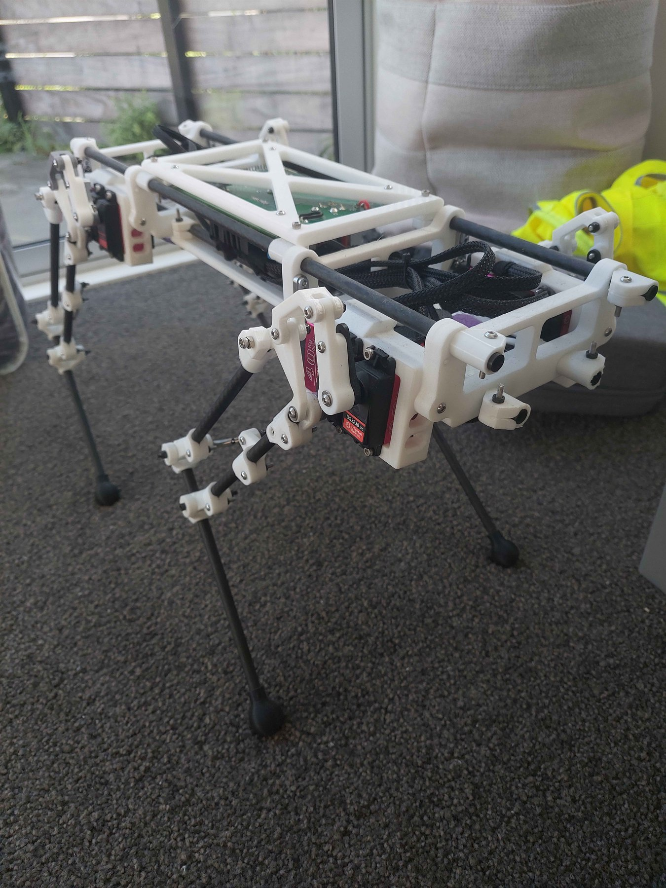
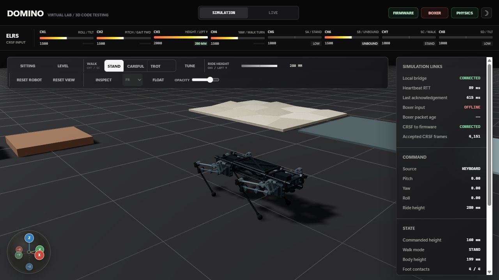
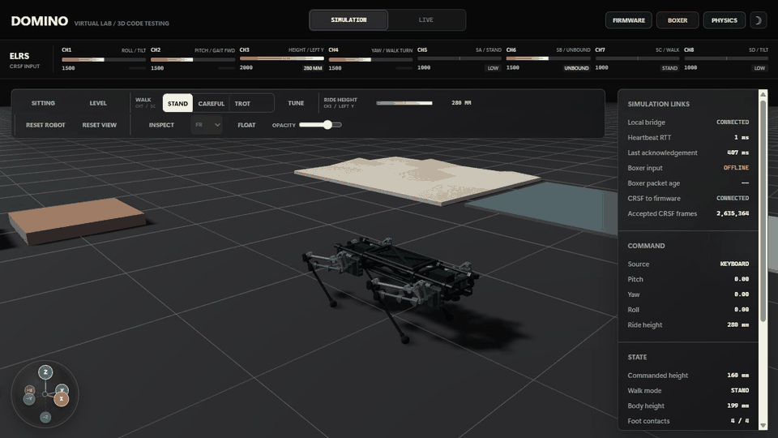
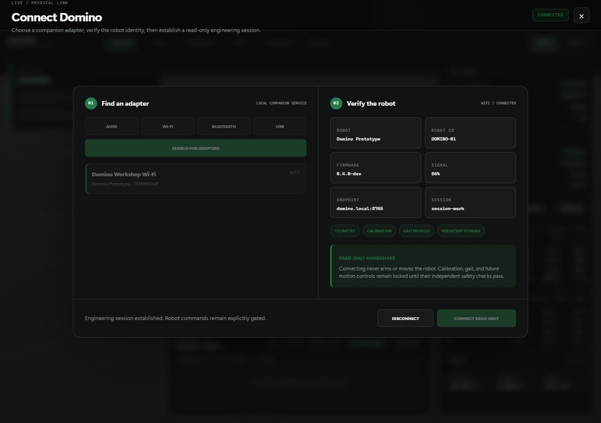
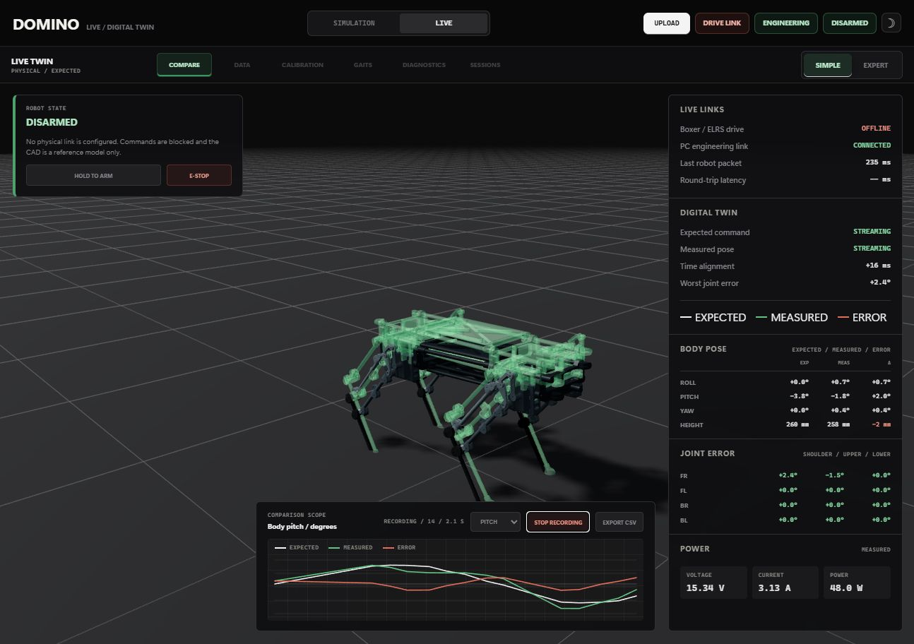
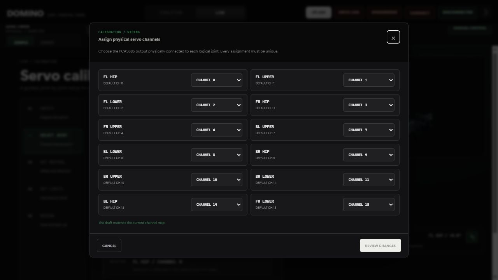
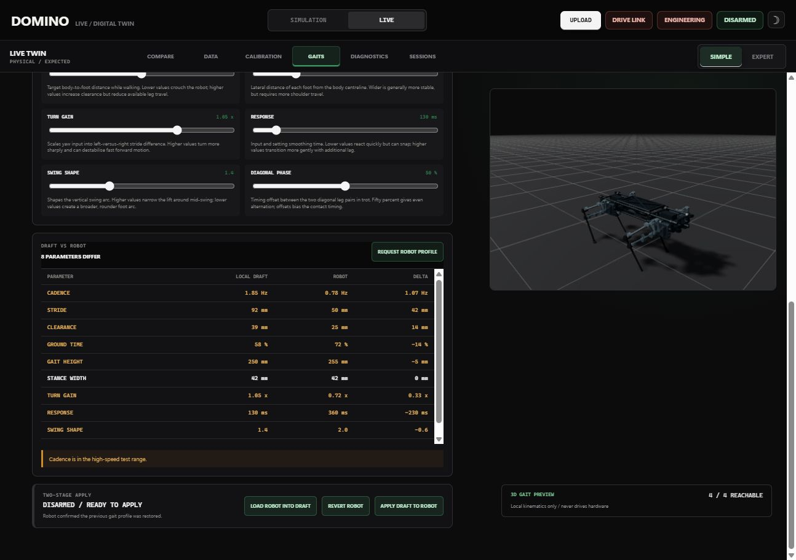
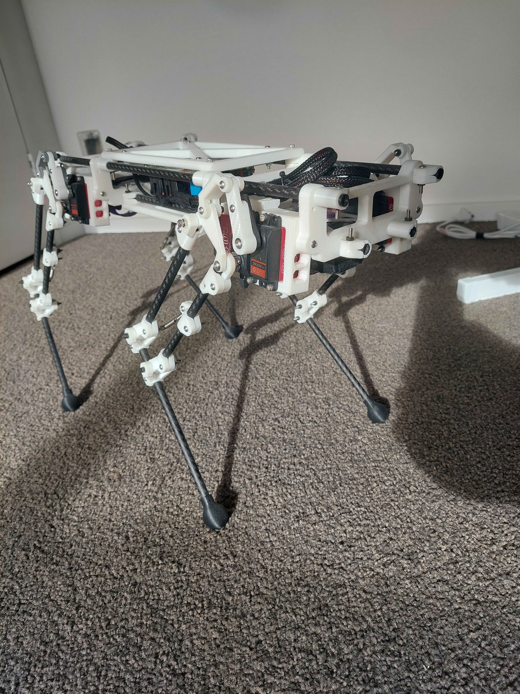
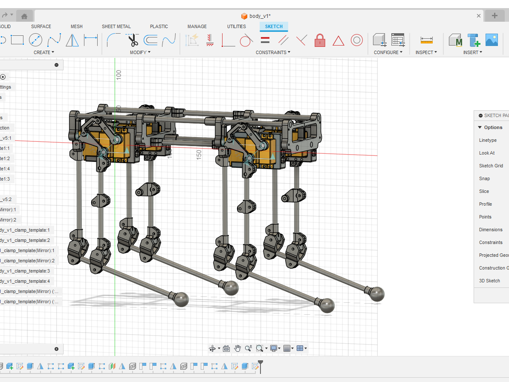
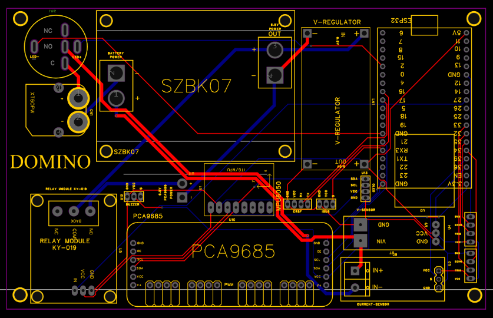

# Domino ESP32 Composite Quadruped

Domino is a prototype ESP32 quadruped robot built around a carbon-and-printed composite chassis, a custom 3-DoF leg mechanism, CRSF/ExpressLRS radio control, PCA9685 servo output, and CAD-to-simulation experiments.

For the portfolio-level explanation of the architecture, control flow, linkage
problem, and the most interesting implementation details, start with the
[Domino Engineering Overview](docs/engineering-overview.md).
Current implementation status and remaining physical-validation gates are in
the [Virtual Lab roadmap status](docs/virtual-lab-roadmap-status.md). Use the
[LIVE hardware bring-up procedure](docs/live-hardware-bring-up.md) before
enabling physical calibration, motion, wireless control, or power telemetry.

> Work in progress: Domino is an active engineering prototype, not a finished kit. The firmware, CAD exports, PCB package, calibration notes, and simulation files are included as a project record and technical reference. The repo does not yet contain a complete step-by-step build manual, measured BOM, wiring diagram, or validated production assembly process.



## Why This Project Matters

Domino is the successor to my earlier SpotMicro ESP32 Nitro work. The earlier project gave me a working base for servo-driven quadruped control, PCB packaging, and RC-controlled robot bring-up. Domino moves beyond that reference design into a more custom platform:

- A scratch-built mechanical layout using carbon members and 3D-printed structural parts.
- A serviceable electronics cage rather than a sealed body shell.
- Per-leg inverse kinematics for a custom 3-DoF mechanism.
- A move from iBUS-style receiver handling to custom CRSF/ExpressLRS parsing on the ESP32.
- A new Domino PCB manufacturing package based on lessons from the older SpotMicro Nitro board.
- CAD, STEP, USD, and Isaac Sim export work documenting the mechanical and simulation path.

As a portfolio project, Domino demonstrates mechanical design, embedded firmware, RC protocol work, power distribution, servo safety, calibration, and simulation constraints in one prototype hardware stack.

## Three Project Tracks

The repository is deliberately split into three connected but distinct tracks:

- **Physical Domino** - the ESP32/PlatformIO firmware, CRSF receiver link,
  servo mapping, CAD-derived IK, electronics, and build documentation for the
  real robot.
- **Isaac Sim / Isaac Lab** - CAD import, closed-linkage experiments,
  actuator/contact modelling, environments, and reinforcement-learning policy
  research.
- **Domino Virtual Lab** - the standalone 3D application for plugging in a
  Boxer controller, exercising the production firmware in a game-like CAD
  environment, and checking changes before hardware bring-up.

The Virtual Lab lives at [`simulation/standalone`](simulation/standalone) for
script compatibility, but it is a separate product track from the Isaac
research environment and the physical firmware project.



The application is committed as **locally runnable source code**, not deployed
as a GitHub Pages website. Clone the repository, install the Virtual Lab's Node
dependencies, and run its PowerShell launcher. See the
[Virtual Lab guide](docs/virtual-lab.md) for setup, screenshots, architecture,
controls, and current limitations.

### Virtual Lab walkthrough

Simulation and LIVE are intentionally separate workspaces. Simulation is the
safe place to change poses, terrain, controller mappings, and gait profiles.
LIVE is the physical-robot engineering workspace: it compares commanded and
measured state, records synchronized telemetry, guides servo calibration, and
keeps every hardware-moving action behind an explicit connection and safety
contract.



The short tour above is captured from the locally running repository build. It
switches between the Simulation and LIVE workspaces, then visits comparison,
calibration, physical channel mapping, telemetry data, gait transfer, and
diagnostics without claiming a physical robot connection.

| LIVE connection and safety | Telemetry and recording |
| --- | --- |
|  |  |

| Physical servo channel mapping | Gait profile transfer |
| --- | --- |
|  |  |

The screenshots use the repository's synthetic verification adapter so the UI
can be demonstrated without implying that a physical robot was connected. The
real ESP32 endpoint fails closed, opens disarmed, and requires fresh heartbeat
and robot acknowledgements before hardware motion is available.

## Current Status

Implemented or documented:

- ESP32 DevKit firmware using PlatformIO and Arduino.
- PCA9685 output for twelve servos across four legs.
- CAD-derived inverse kinematics for hip, upper-leg, and lower-linkage angles.
- Custom CRSF/ExpressLRS receiver parser with packed-channel decoding, filtering, switch debouncing, and link-loss handling.
- Stand, stow, body tilt, continuous ride height, and a first sinusoidal gait mode.
- MPU6050 IMU sampling and filtered roll/pitch state.
- Per-servo safety limits to reduce the chance of driving the mechanism into hard stops.
- STEP exports for assembly, body, and leg inspection.
- USD/USDZ exports from the Isaac Sim exploration path.
- Raw Isaac Lab URDF import smoke test documented for the generated CAD export.
- Domino PCB V1.1B Gerber package and PCB screenshots.

Still in progress:

- Gait tuning beyond the first slow diagonal sinusoidal trot.
- Dynamic balance tuning.
- A complete measured BOM.
- Wiring diagrams and annotated cable-routing photos.
- Printed-part orientation, fastener, bearing, insert, and rod-length documentation.
- A validated start-to-finish public build manual.

## Where To Start

If you are looking to build the project start here:

1. [docs/engineering-overview.md](docs/engineering-overview.md) - portfolio overview, architecture, data flow, code tour, and current boundaries.
2. [docs/control-notes.md](docs/control-notes.md) - coordinate frames, IK constants, servo mapping, and mode flow.
3. [docs/crsf.md](docs/crsf.md) - CRSF/ExpressLRS parser and receiver migration notes.
4. [docs/cad-design.md](docs/cad-design.md) - mechanical structure, STEP exports, composite cage, and simulation limitations.
5. [docs/electronics.md](docs/electronics.md) - electronics architecture, PCB evolution, and power/control notes.
6. [hardware/pcb/domino-quadruped-pcb-v1.1b](hardware/pcb/domino-quadruped-pcb-v1.1b) - Domino PCB V1.1B Gerber package.

## Mechanical Design

Each leg has three actuated degrees of freedom:

- Hip abduction/adduction.
- Upper-leg pitch.
- Lower linkage / knee motion.

The body uses a long central cage instead of a compact square chassis. This keeps wiring, receiver placement, PCB access, and servo harness routing serviceable while giving the leg modules room to move.

The lower leg behaves more like a closed-chain/four-bar mechanism than a simple open-chain robot arm. That creates useful packaging options, but it also makes firmware and simulation more demanding: servo mapping, linkage clearances, safe joint limits, and CAD-derived IK constants all need to agree.





The neutral CAD exports are included under [cad/step](cad/step). The mechanical write-up is in [docs/cad-design.md](docs/cad-design.md).

## Electronics

Domino began by reusing the electronics architecture from my SpotMicro ESP32 Nitro fork: ESP32 control, PCA9685 servo output, external servo power, receiver wiring, sensor headers, and utility connections gathered into a serviceable board layout.

The first Domino prototype reused the older PCB directly. Moving to CRSF/ExpressLRS did not require a full board redesign: the receiver needed suitable power, common ground, and its TX signal routed into the ESP32 serial input used by the firmware.

The newer Domino PCB V1.1B is a dedicated board package for this platform. It follows the same ESP32/PCA9685 quadruped-control concept, but adds extra headers, improves connector layout and silkscreen presentation, and addresses practical issues found while using the older board.




More detail is in [docs/electronics.md](docs/electronics.md).

## Firmware Architecture

The firmware is split by responsibility:

- `src/crsf.cpp` / `src/crsf.h`: CRSF frame parsing, channel unpacking, filtering, and link-health state.
- `src/ik.cpp` / `src/ik.h`: CAD-derived single-leg inverse kinematics.
- `src/leg_controller.cpp` / `src/leg_controller.h`: PCA9685 channel mapping, direction signs, trims, and servo limit enforcement.
- `src/imu.cpp` / `src/imu.h`: MPU6050 initialization, sampling, and filtered orientation state.
- `src/main.cpp`: high-level state machine, body pose model, ride height, tilt mode, sinusoidal gait, balance experiment, and failsafe behavior.

High-level behavior generates body/foot pose targets, then passes them through the same IK and servo mapping path. Stand, stow, tilt, balance, and gait therefore use the same CAD-derived geometry and servo safety limits.

### Test Firmware Before Hardware

Domino now has a desktop software-in-the-loop build under
[simulation/sil](simulation/sil). It compiles the production `src/main.cpp`,
CRSF parser, mode logic, IK, trims, channel mapping, and servo safety limits
directly against simulated Arduino hardware. There is no second copy of the
control algorithm to keep in sync.

Run the deterministic safety scenario:

```powershell
.\simulation\sil\test.ps1
```

Open the live firmware monitor:

```powershell
.\simulation\sil\launch.ps1
```

The first stage validates the exact commands that would be sent to the
PCA9685 without powering a servo. It covers startup stow, valid CRSF parsing,
debounced mode changes, stand and tilt movement, continuous ride height, gait
stride/lift, the tilt interlock, link
loss, failsafe stow, and all 12 output pulse widths. The next integration stage
will feed those same outputs into the CAD-derived Isaac articulation and accept
Boxer input over USB.

## CRSF / ExpressLRS Radio Link

One major goal of Domino was replacing simpler iBUS-style receiver handling with CRSF. CRSF is common in ExpressLRS systems and gives the robot a fast serial RC link, but it also requires correct frame synchronization, CRC validation, packed-channel decoding, filtering, and failsafe behavior.

The robot repo includes the integrated parser in `src/crsf.*` and a small example under [examples/crsf-esp32-reader](examples/crsf-esp32-reader). The reusable extraction now lives in its own repo:

- [Blacksheep909/ESP32_CRSF_Reader](https://github.com/Blacksheep909/ESP32_CRSF_Reader)

## CAD And Simulation Exports

The repo includes:

- STEP files under [cad/step](cad/step).
- USD/USDZ exports under [simulation/usd](simulation/usd).
- URDF reference export, Isaac topology report, and simulation bring-up notes under [simulation/isaac](simulation/isaac).
- CAD and simulation notes in [docs/cad-design.md](docs/cad-design.md) and [docs/simulation-notes.md](docs/simulation-notes.md).

The CAD-derived Isaac articulation and reinforcement-learning environment are
still work in progress. The real leg mechanism is a closed-chain linkage rather
than a simple URDF tree, so the simulation uses explicit pin-joint and linkage
handling. The firmware SIL is deliberately separate from contact physics: it
validates control decisions quickly, while Isaac validates mechanism motion,
contacts, and learned policies.

## Build And Bring-Up Status

The firmware can be built with PlatformIO:

```powershell
pio run
```

The LIVE workspace can connect to firmware `0.6.0` over ESP32 USB serial,
Wi-Fi TCP, or a paired Bluetooth SPP port through the fail-closed PC companion. See
[`docs/live-companion-protocol.md`](docs/live-companion-protocol.md) for the
protocol, startup command, supported capabilities, and hardware safety rules.

Upload to an ESP32 DevKit:

```powershell
pio run -t upload
```

Open the serial monitor:

```powershell
pio device monitor
```

Hardware bring-up should be done in layers: receiver first, then one servo, then one leg, then all legs on a stand. The current docs do not yet contain enough measured hardware detail to recommend building the full robot directly from the repo.

## Repository Layout

```text
.
|-- cad/
|   `-- step/                STEP exports for assembly, body, and leg modules
|-- hardware/
|   `-- pcb/                 Domino PCB Gerber package and notes
|-- simulation/
|   |-- isaac/               Isaac Sim / Isaac Lab bring-up notes and URDF topology tooling
|   |-- standalone/          Domino Virtual Lab 3D firmware/CAD testing app
|   |-- sil/                 Desktop build of the production firmware and live monitor
|   |-- urdf/generated/      Generated URDF reference export
|   `-- usd/                 USD/USDZ exports for Isaac Sim experiments
|-- platformio.ini          PlatformIO build configuration
|-- src/                    Robot firmware
|-- examples/
|   `-- crsf-esp32-reader   Standalone CRSF parser demo
|-- docs/                   Design, calibration, electronics, and simulation notes
|-- include/                Project include directory
|-- lib/                    Project-local libraries
`-- test/                   Future firmware tests
```

## Related Work

This project builds on lessons from my earlier SpotMicro ESP32 fork:

- [Blacksheep909/SpotMicroESP32-Nitro-Fork](https://github.com/Blacksheep909/SpotMicroESP32-Nitro-Fork)

The earlier fork is closer to an instructional build log. Domino is a custom engineering snapshot: the firmware, CAD, PCB work, and simulation experiments are being shaped into a cleaner quadruped platform.

## Credits

Domino's mechanical direction is derived from the ESP32 quadruped robot design by [Tazer Technical](https://www.youtube.com/@TazerTechnical). Thanks to Tazer Technical for publishing the design ideas and build material that helped shape this project.
