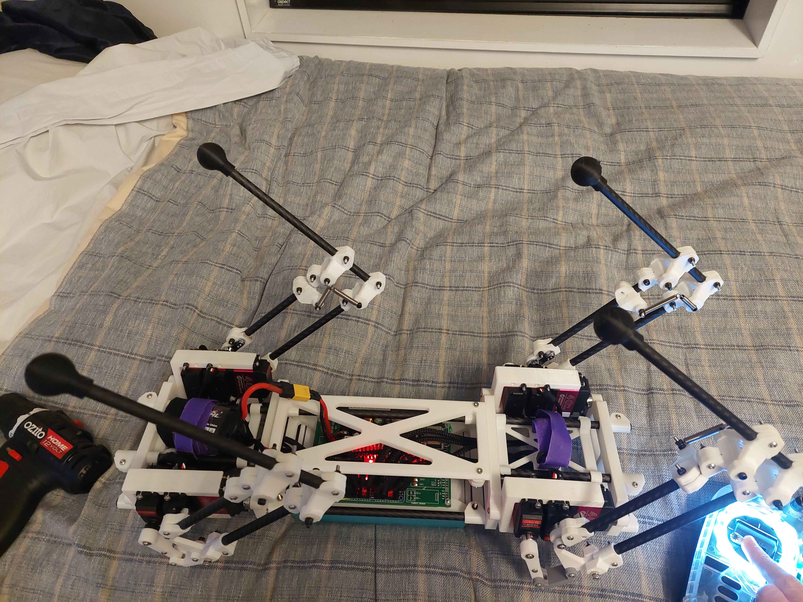

# V10_CRSF_TY90

ESP32 firmware for a custom 3-DoF quadruped robot platform. This version focuses on clean leg kinematics, RC control over CRSF/ExpressLRS, safe stand/stow behavior, body tilt control, ride-height presets, and early IMU-assisted balance experiments.



## Project Status

This is a work-in-progress robotics firmware project, prepared here as a portfolio snapshot. The current code is centered on reliable low-level control and pose handling rather than a finished walking gait.

Implemented:

- ESP32 DevKit firmware using PlatformIO and Arduino.
- PCA9685-based PWM output for 12 servos across four 3-DoF legs.
- Per-leg inverse kinematics for hip, upper leg, and lower linkage angles.
- CRSF/ExpressLRS receiver input with switch debouncing and link-loss handling.
- Stand, stow, body tilt, and balance modes.
- Three ride-height presets selected from an RC switch.
- MPU6050 IMU sampling with filtered accelerometer and gyroscope state.
- Debug logging for mode transitions, RC link state, body pose, and balance behavior.

Still in progress:

- Full gait generation and walking trajectory control.
- More robust balance tuning on hardware.
- Cleaner calibration tooling for servo trims and horn alignment.
- Better project-level documentation for the mechanical CAD and wiring.

## Hardware

Core electronics:

- ESP32 DevKit board.
- PCA9685 servo driver.
- 12x 270-degree servos, three per leg.
- MPU6050 IMU.
- ExpressLRS / CRSF receiver.
- External high-current servo power supply.

Robot layout:

- Four legs, each with hip abduction/adduction plus two pitch-axis joints.
- Custom printed body and linkage parts.
- Carbon tube / rod style leg members.
- CAD-derived hip spacing and leg dimensions baked into the kinematic model.

## Control Modes

- `BODY_STOW`: curls the legs toward the body for a compact safe state.
- `BODY_STAND`: moves into a neutral standing pose and holds body height.
- `BODY_TILT`: maps RC stick input into body roll, pitch, and yaw while feet remain in a nominal stand layout.
- `BODY_BALANCE`: uses IMU roll/pitch estimates to apply per-leg Z offsets for early active balancing.

The firmware is designed to fail safe: if the CRSF link is lost for long enough, the command path drops back toward stow behavior.

## Repository Layout

```text
.
|-- platformio.ini          PlatformIO build configuration
|-- src/
|   |-- main.cpp            State machine, body pose model, RC mode handling
|   |-- crsf.cpp/.h         CRSF frame parsing and channel state
|   |-- ik.cpp/.h           Single-leg inverse kinematics
|   |-- imu.cpp/.h          MPU6050 sampling and filtering
|   `-- leg_controller.*    Servo mapping, trims, and per-leg wrappers
|-- lib/Ramp/               Local ramp/interpolation dependency
|-- docs/
|   |-- control-notes.md    Kinematics, frames, and calibration notes
|   `-- images/             Portfolio images
`-- include/, test/         Standard PlatformIO project folders
```

## Build

Open the project folder in VS Code with the PlatformIO extension installed, or build from a terminal:

```powershell
pio run
```

Upload to the ESP32:

```powershell
pio run -t upload
```

Open the serial monitor at 115200 baud:

```powershell
pio device monitor
```

## Calibration Notes

Servo trims live in `src/leg_controller.h`. The intended workflow is:

1. Power the robot safely on a stand so the legs can move freely.
2. Center the servos mechanically as close as possible.
3. Enter stand mode with tilt disabled and RC sticks centered.
4. Adjust per-servo trim values until the robot is symmetric and level.
5. Re-test stand, stow, tilt, and balance modes after every trim pass.

Large trim values usually mean a servo horn should be re-clocked mechanically before relying on code offsets.

## Related Work

This project builds on lessons from my earlier SpotMicro ESP32 fork:

- [Blacksheep909/SpotMicroESP32-Nitro-Fork](https://github.com/Blacksheep909/SpotMicroESP32-Nitro-Fork)

Unlike the SpotMicro fork, this V10 project is organized around a newer custom mechanical platform and a cleaner firmware structure for CRSF input, body pose control, and future gait experiments.

