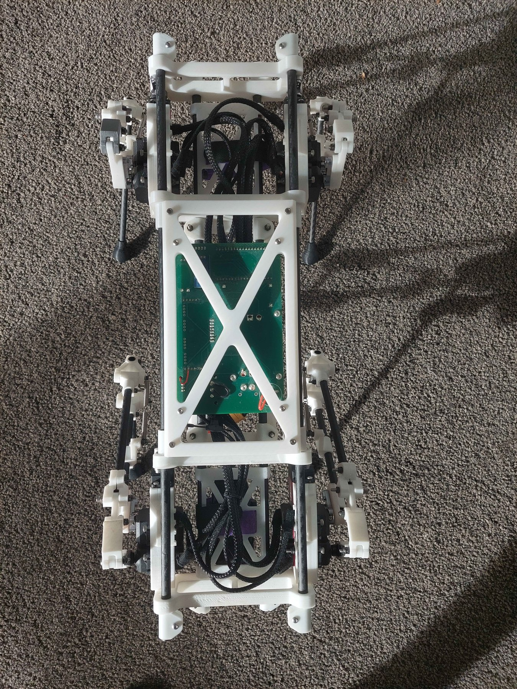
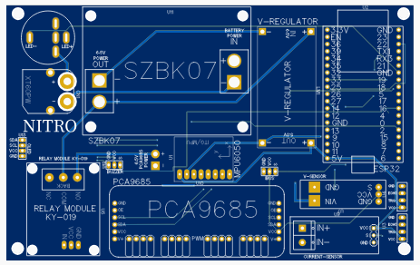
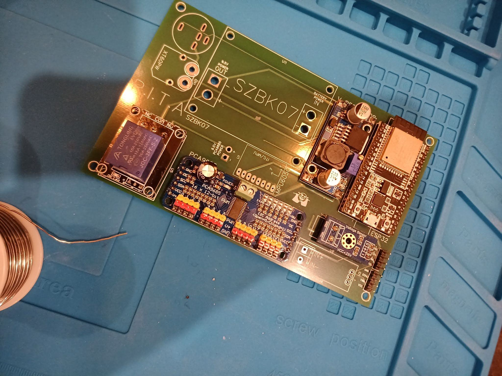

# Domino ESP32 Composite Quadruped

Custom ESP32 firmware and system notes for Domino, a scratch-built carbon-frame 3-DoF quadruped robot. This project sits at the intersection of CAD, embedded firmware, RC control, power electronics, servo calibration, and robotics simulation.

> Work in progress: Domino is an active prototype, not a finished kit. The firmware, safety limits, CAD notes, wiring, and calibration process are still being validated on real hardware.

The public project name is Domino. Internally, this build started as the `V10` / `TY90` iteration. `V10` reflects the number of design passes this robot went through, while `CRSF` is the radio-control link used by the firmware.


## Project Details

My earlier robot dog work started from a SpotMicro ESP32 fork. That was useful because it gave me a working reference for servo-driven quadruped control, custom PCB layout, and hobby-radio control. Domino is the next step: a custom mechanical platform with a cleaner firmware architecture, a more deliberate body/electronics layout, and a major radio-link upgrade from iBUS-style receiver code to custom CRSF/ExpressLRS parsing on the ESP32.

The project is not just "code for a robot." It is a full stack hardware project:

- CAD-designed body and leg linkages.
- 3D-printed structural parts and carbon rod/tube members.
- A central electronics cage that carries the PCB, battery wiring, receiver, regulator, and servo harnesses.
- ESP32 firmware using PlatformIO and Arduino.
- Custom CRSF/ExpressLRS receiver input with failsafe behavior.
- Inverse kinematics for four 3-DoF legs.
- Isaac Sim / USD export experiments to explore simulation before hardware testing.

## Mechanical Build and Composite Structure Information

The main challenge is that the robot is mechanically simple in appearance but awkward in all the useful ways: multiple servos, mirrored geometry, heavy wiring, uncertain trim offsets, flexible printed parts, a high-speed CRSF serial receiver stream, and a leg mechanism that behaves like a closed-chain/four-bar linkage rather than a clean open-chain robot arm.

That forced the firmware to be explicit about geometry, coordinate frames, servo direction signs, and safe state transitions. The code is written so that future work, especially walking gaits, can build on a stable low-level model rather than repeatedly re-solving servo mapping problems.


## Current Status

Implemented:

- ESP32 DevKit firmware using PlatformIO and Arduino.
- PCA9685 PWM output for 12 servos across four legs.
- Per-leg inverse kinematics for hip, upper leg, and lower linkage angles.
- Custom CRSF/ExpressLRS receiver parser with channel unpacking, filtering, switch debouncing, and link-loss handling.
- Stand, stow, body tilt, and experimental balance modes.
- Three ride-height presets selected from an RC switch.
- MPU6050 IMU sampling with filtered accelerometer and gyroscope state.
- Debug logging for mode transitions, RC link state, body pose, and balance behavior.

Still in progress:

- Full walking gait generation.
- More robust dynamic balance tuning.
- Better calibration tooling for servo trims and horn alignment.
- More measured drawings and build-ready print/export notes.
- Wiring diagrams and short demo clips.

## Start Here If You Want To Build One

This repository is written as both a portfolio project and a build reference. If you are trying to reproduce or adapt the robot, read these in order:

1. [docs/hardware-checklist.md](docs/hardware-checklist.md) - parts, tools, and decisions to make before printing or wiring anything.
2. [docs/cad-design.md](docs/cad-design.md) - CAD exports, composite cage design, leg modules, and simulation constraints.
3. [docs/build-guide.md](docs/build-guide.md) - mechanical, electronics, firmware, and first-power-up sequence.
4. [docs/calibration-guide.md](docs/calibration-guide.md) - servo centering, trim values, and safe stand/stow testing.
5. [docs/troubleshooting.md](docs/troubleshooting.md) - common failures and what to check first.
6. [docs/control-notes.md](docs/control-notes.md) - deeper coordinate frames, IK, and servo mapping.

The most important rule is to test in layers: receiver first, then one servo, then one leg, then all legs on a stand, then body modes. Do not jump straight from flashing firmware to putting the robot on the floor.

## Mechanical Design

Each leg has three actuated degrees of freedom:

- Hip abduction/adduction.
- Upper leg pitch.
- Lower linkage / knee motion.

The body uses a long central cage layout rather than a dense square chassis. The goal was to keep the wiring and electronics accessible while giving the leg modules enough spacing to move without immediately colliding with the body.

The center section is effectively an electronics spine: printed end plates and cross braces hold the body rails, while the PCB, receiver, regulator, battery wiring, and servo harnesses sit inside the protected middle bay. It is easier to service than burying the electronics under a shell, and it makes the robot's iteration history visible.



The current neutral CAD exports are included under [cad/step](cad/step). The main design write-up is [docs/cad-design.md](docs/cad-design.md), which covers the STEP files, modular leg design, electronics cage, firmware geometry assumptions, and the Isaac Sim / URDF export limitations.

## Electronics

The electronics are based on the PCB architecture from my earlier SpotMicro ESP32 Nitro fork. That board was designed to reduce wiring mess and make the servo/power layout repeatable:

- ESP32 DevKit as the main controller.
- PCA9685 servo driver for multi-servo PWM output.
- External regulator / BEC path for servo power.
- CRSF/receiver wiring.
- Sensor and utility headers.
- Space for buzzer/relay/current/voltage-related modules used during earlier experiments.

The PCB itself has not been redesigned for Domino. The CRSF/ExpressLRS receiver change is a small, practical modification: route receiver power, ground, and the receiver TX line into the ESP32 serial input used by the firmware, then mount the receiver inside the electronics cage.





The Domino chassis reuses this electronics approach but changes the mechanical packaging around it. More detail is in [docs/electronics.md](docs/electronics.md).

## CRSF / ExpressLRS Radio Link

One of the big goals of this version was moving away from simpler iBUS-style receiver handling and onto CRSF. CRSF is faster and more common in modern ExpressLRS setups, but it also means the firmware has to parse packed frames correctly instead of relying on a basic hobby-servo pulse style interface.

The custom ESP32 CRSF code handles:

- `Serial2` at 420000 baud.
- CRSF frame synchronization and length validation.
- DVB-S2 CRC8 validation.
- Packed 11-bit channel decoding for 16 RC channels.
- Conversion into 1000-2000 us style channel values.
- First- and second-order filtering before the control loop consumes stick/switch state.
- Link timeout detection for failsafe behavior.

That receiver layer is important enough that this repo includes both the robot integration in `src/crsf.*` and a standalone extraction in [examples/crsf-esp32-reader](examples/crsf-esp32-reader). It could become its own small repository later if the goal is to present it as a reusable ESP32 CRSF reader.

## Firmware Architecture

The firmware separates the problem into small pieces:

- `src/crsf.cpp`: CRSF frame parsing and RC channel state.
- `src/ik.cpp`: single-leg inverse kinematics.
- `src/leg_controller.cpp`: servo channel mapping, direction signs, and trim offsets.
- `src/imu.cpp`: MPU6050 reading and filtering.
- `src/main.cpp`: state machine, body pose math, ride height, tilt, balance, and failsafe behavior.

The most important design choice is that high-level behaviors generate foot/body pose targets, then feed them through the same IK and servo mapping path. That keeps stand, stow, tilt, and future gaits consistent.

See [docs/crsf.md](docs/crsf.md) for the receiver migration notes and parser details.
See [docs/control-notes.md](docs/control-notes.md) for the coordinate frames, servo channels, and calibration details.

## Simulation Work

I also tried bringing the CAD into Isaac Sim. The project folder contains USD exports generated from the robot CAD, including separate part files for rods, pivots, servo hubs, arms, and body plates.

The hard part was the leg mechanism. The physical linkage is closer to a closed-chain/four-bar mechanism, while many robot simulation and URDF-style workflows prefer tree-structured articulated bodies. That means a literal CAD import does not automatically produce a controllable robot model with the same constraints as the real linkage.

That was still useful: it exposed the gap between "CAD looks correct" and "simulation has the right joints, constraints, inertia, and actuation model." More detail is in [docs/simulation-notes.md](docs/simulation-notes.md).

## Build

Install:

- [VS Code](https://code.visualstudio.com/)
- PlatformIO IDE extension for VS Code
- Git, if you want to clone instead of downloading the repository

Open this folder in VS Code with the PlatformIO extension installed, or build from a terminal:

```powershell
pio run
```

Upload to the ESP32:

```powershell
pio run -t upload
```

Open the serial monitor at 115200 baud:

```powershell
pio device monitor
```

## Repository Layout

```text
.
|-- cad/
|   `-- step/                STEP exports for assembly, body, and leg modules
|-- platformio.ini          PlatformIO build configuration
|-- src/
|   |-- main.cpp            State machine, body pose model, RC mode handling
|   |-- crsf.cpp/.h         CRSF frame parsing and channel state
|   |-- ik.cpp/.h           Single-leg inverse kinematics
|   |-- imu.cpp/.h          MPU6050 sampling and filtering
|   `-- leg_controller.*    Servo mapping, trims, and per-leg wrappers
|-- lib/Ramp/               Local ramp/interpolation dependency
|-- examples/
|   `-- crsf-esp32-reader   Standalone CRSF parser demo
|-- docs/
|   |-- build-guide.md      Step-by-step build and bring-up sequence
|   |-- cad-design.md       CAD exports and mechanical design notes
|   |-- calibration-guide.md Servo centering and trim workflow
|   |-- control-notes.md    Kinematics, frames, and calibration notes
|   |-- crsf.md             CRSF/ExpressLRS parser and migration notes
|   |-- electronics.md      PCB and electronics cage notes
|   |-- hardware-checklist.md Parts, tools, and pre-build checks
|   |-- simulation-notes.md Isaac Sim / USD import notes
|   |-- troubleshooting.md  Bring-up and debugging checklist
|   `-- images/             Portfolio images
`-- include/, test/         Standard PlatformIO project folders
```

## Related Work

This project builds on lessons from my earlier SpotMicro ESP32 fork:

- [Blacksheep909/SpotMicroESP32-Nitro-Fork](https://github.com/Blacksheep909/SpotMicroESP32-Nitro-Fork)

The earlier fork is closer to an instructional build log. Domino is more of an engineering snapshot: the firmware and mechanical design are being shaped into a custom platform that can support future gait and simulation work.

## Credits

Domino's mechanical direction is derived from the ESP32 quadruped robot design by [Tazer Technical](https://www.youtube.com/@TazerTechnical). Thanks to Tazer Technical for publishing the design ideas and build material that helped shape this project.
