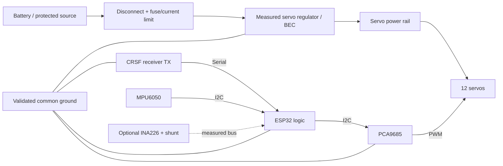

# Domino Public Build And Bring-Up Manual

This is the repository entry point for building, wiring, flashing, calibrating,
and commissioning a Domino-style quadruped. It separates facts proven by the
repository from measurements required on each physical build.

## Evidence labels

- **Repository-confirmed** — encoded in current source, CAD, tests, or a
  versioned manufacturing artifact.
- **Design reference** — the current prototype direction, not a purchasing or
  manufacturing guarantee.
- **Measure before power** — record this for the parts actually installed.
- **Physical validation required** — software/build evidence cannot prove it.

Copy [the build record](build-record-template.md) before starting. It captures
part numbers, dimensions, wiring, limits, measurements, and gate results.

## 1. Safety boundary

Twelve high-torque servos can move suddenly and draw destructive current.

1. Provide a physical servo-power disconnect independent of software.
2. Use a supported chassis or bench jig whenever outputs can energize.
3. Start with USB logic power and the servo rail disconnected.
4. Add one subsystem, one servo, one leg, then the suspended robot. Stop at the
   first unexpected result.
5. Software limits do not prove wiring, polarity, regulator sizing, fuse
   selection, or mechanical clearance is safe.

## 2. Choose the build boundary

| Path | Included evidence | Builder responsibility |
| --- | --- | --- |
| **Adapt the controller** | PlatformIO firmware, CRSF parser, PCA9685 routing, LIVE calibration, CAD-derived control geometry | Validate the new chassis, servo map, power system, and limits |
| **Reproduce the prototype direction** | Above plus current STEP/STL/URDF references and PCB V1.1B Gerbers | Measure print settings, fasteners, rods, bearings/inserts, servo variants, wiring, clearances, and mass |

The repository does not claim that ordering the PCB and printing the CAD creates
a validated clone without those measurements.

## 3. Source artifacts

| Repository-confirmed artifact | Location | Use |
| --- | --- | --- |
| ESP32 firmware | [`platformio.ini`](../platformio.ini), [`src`](../src) | Controller behavior and safety limits |
| Full CAD reference | [`cad/step/combined/Domino_URDF_Parts_Combined_Final.step`](../cad/step/combined/Domino_URDF_Parts_Combined_Final.step) | Assembly inspection and measurement |
| Leg/body STEP exports | [`cad/step/parts`](../cad/step/parts) | Mirroring, clearance, module inspection |
| Render/simulation meshes | [`simulation/urdf/generated`](../simulation/urdf/generated) | Virtual Lab and kinematics, not slicer-ready manufacturing proof |
| PCB prototype package | [`hardware/pcb/domino-quadruped-pcb-v1.1b`](../hardware/pcb/domino-quadruped-pcb-v1.1b) | Gerber inspection and prototype manufacture |
| Virtual Lab | [`simulation/standalone`](../simulation/standalone) | Simulation, LIVE telemetry, calibration, logging |
| Native safety harness | [`simulation/sil`](../simulation/sil) | Production control logic before hardware power |

## 4. Build-specific BOM

This is a functional BOM, not a verified shopping list. Record exact part
numbers and ratings in the build record.

| Subsystem | Design reference | Evidence required before use |
| --- | --- | --- |
| Controller | ESP32 DevKit-style board | Board/revision, USB/UART behavior, logic supply |
| Servo PWM | PCA9685 or Domino PCB V1.1B | I2C address, oscillator, connector polarity |
| Radio | CRSF/ExpressLRS receiver | Model, supply, bound transmitter, signal voltage |
| IMU | MPU6050 | Module identity, orientation, I2C address |
| Actuators | Twelve 270° servos; prototype direction uses 40 kg-class shoulders and 35 kg-class other drives | Models, voltage, no-load/stall current, spline, travel |
| Servo supply | External regulator/BEC | Input/output, continuous/peak rating, cooling, transients |
| Battery | Simulation mass model references two CNHL 1500 mAh 4S packs | Actual count, chemistry, capacity, C rating, connector, condition |
| Protection | Fuse/current limit and isolation | Rating, interrupt capability, location, tested disconnect |
| Harness | Power, servo, receiver, I2C wiring | Gauge, connector, polarity, strain relief, ground plan |
| Mechanics | Printed parts, carbon members, pivots, rods, inserts/bearings, feet, fasteners | Material, settings, dimensions, quantities |
| Optional power sensing | INA226 and external shunt | Shunt resistance, current range, dissipation, calibration |

## 5. Mechanical preparation

1. Inspect the combined STEP model, all leg modules, mirrored parts, servo
   orientation, electronics cage, and cable exits.
2. Measure fasteners, inserts/bearing seats, rods/tubes, servo pockets, pivots,
   and printed tolerances before ordering or printing.
3. Print one representative joint or mount and verify fit without force.
4. Assemble one unpowered linkage. It must traverse the intended envelope
   without binding, contact, or branch inversion.
5. Record horn spline/length and achievable neutral position.
6. Only then produce the remaining mirrored parts and body structure.

See [CAD design notes](cad-design.md). CAD control coordinates are not a
substitute for measuring manufactured parts.

## 6. Electrical architecture



**Repository-confirmed firmware interfaces:**

- CRSF uses `Serial2`, 420000 baud, ESP32 RX GPIO 16 and TX GPIO 17. Receiver
  TX feeds ESP32 RX; this does not define the receiver connector pin order.
- PCA9685 and MPU6050 use the selected ESP32 board's default `Wire` I2C pins;
  firmware calls `Wire.begin()` without explicit SDA/SCL values.
- PWM is 50 Hz with a 27 MHz PCA9685 oscillator reference.
- Conversion covers 500–2500 µs over the nominal 270° electrical range, then
  applies stricter per-joint limits.
- Servo power is external to USB/logic power and signal domains need the
  intended common ground.

**Measure before power:** connector order, actual I2C pins, rail polarity,
logic levels, regulator output, fuse, wire gauge, connector ratings, and
power-to-ground resistance.

## 7. Default logical servo routing

The compiled fallback is non-contiguous. Verify destinations rather than
assuming `leg × 3` ordering.

| Leg | Hip | Upper | Lower |
| --- | ---: | ---: | ---: |
| Front left | 0 | 1 | 2 |
| Front right | 3 | 4 | 15 |
| Back left | 14 | 7 | 8 |
| Back right | 9 | 10 | 11 |

Channels 5, 6, 12, and 13 are unused by the fallback. LIVE Calibration can
persistently remap joints to unique outputs 0–15; use the as-built harness map
when wiring differs.

## 8. Firmware and software preparation

Install Git, Node.js, pnpm, Python/PlatformIO, and the PlatformIO MinGW toolchain
used by SIL. From the repository root:

```powershell
pio run
cd simulation\standalone
pnpm install
pnpm test
pnpm build
cd ..\sil
.\build.ps1
.\bin\domino_sil.exe --duration-ms 11500
```

Do not enable Wi-Fi, Bluetooth, or INA226 flags until their secrets, transport,
and measured prerequisites in [LIVE bring-up](live-hardware-bring-up.md) are met.

## 9. Layered assembly and commissioning

### Gate A — unpowered inspection

- Record every component and harness endpoint.
- Check polarity and continuity with the battery disconnected.
- Confirm the physical disconnect removes servo-rail energy.
- Leave horns/linkages unloaded or disconnected.

### Gate B — USB logic only

```powershell
pio run -t upload
pio device monitor
```

Expected: 460800-baud application logs and the defined safe startup pose. ESP32
ROM boot text is emitted before the application changes baud and may therefore
appear garbled in a monitor already set to 460800.

### Gate C — receiver and IMU

- Bind with the stand/arm switch safe.
- Confirm fresh CRSF frames, channel movement, and failsafe.
- Confirm MPU6050 detection and installed axis orientation.

### Gate D — one unloaded servo

- Use a current-limited source at the measured servo voltage.
- Center at 135° before installing the horn.
- Connect only the intended mapped output.
- Verify direction, neutral, and conservative unloaded travel.

### Gate E — one supported leg

- Assemble one leg with chassis load removed.
- Enter LIVE Calibration bench mode.
- Jog one joint at no more than the firmware's 5°/s limit.
- Establish neutral, direction, and limits joint by joint. Stop on buzzing,
  heating, hard contact, or unexpected output selection.

### Gate F — suspended robot

- Connect all verified channels with the body supported.
- Verify E-stop, disconnect, watchdog, and link loss before arming.
- Test stow, stand, height, and tilt before gait.
- Record idle/transition/load voltage and current only with independently
  calibrated measurement hardware.

### Gate G — restrained floor test

- Start with short low-speed tests and an operator at the disconnect.
- Confirm clearance, thermal behavior, sag/current, and link recovery.
- Compare a LIVE session with the suspended baseline before raising speed.

Detailed commands and evidence are in [LIVE hardware bring-up](live-hardware-bring-up.md).

## 10. Calibration and as-built configuration

Follow [the calibration guide](calibration-guide.md). Export the versioned JSON
profile after channel routing, neutral, direction, and limits. Photograph horn
neutral positions, label cables, and record the JSON filename and firmware
commit in the build record.

## 11. Acceptance evidence

A public build is not validated until its record includes:

- Exact BOM and revisions.
- Print settings and critical dimensions.
- As-built wiring diagram, pinouts, gauges, protection, and ground plan.
- DMM-confirmed logic and servo voltages.
- Independent current/power comparison if INA226 is enabled.
- Twelve channel destinations, offsets, directions, and safe limits.
- E-stop, watchdog, receiver failsafe, PC-link loss, and power-cycle results.
- Suspended and restrained-floor LIVE sessions.
- Wiring, neutral-horn, supported-calibration, and final-assembly media.

Until those fields are measured, this is an engineering starting point—not a
certified appliance or guaranteed kit.
