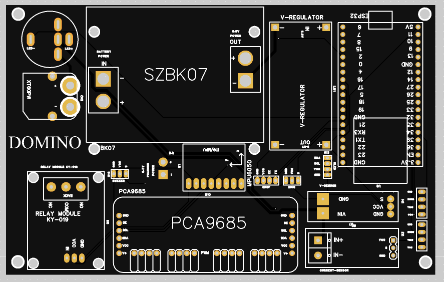

# Electronics Notes

Domino uses the same electronics direction as the earlier SpotMicro ESP32 Nitro project: reduce wiring uncertainty by putting the major control and power interfaces onto a repeatable board, then mount that board inside a serviceable center bay.

## System Blocks

Main components:

- ESP32 DevKit controller.
- PCA9685 PWM servo driver.
- CRSF/ExpressLRS receiver input.
- External high-current servo power path.
- Regulated logic power.
- MPU6050 IMU.
- Servo harnesses for twelve 270-degree servos.

The first Domino prototype reused the earlier SpotMicro PCB unchanged as the basis for its electronics layout. That kept the wiring strategy consistent across robot versions.

On the original board, the CRSF upgrade was intentionally easy to add: the receiver only needed suitable power, common ground, and its TX signal routed to the ESP32 serial RX pin used by the firmware. The receiver could then be mounted inside the central electronics cage without changing the core PCB.

## Electronics Cage

The Domino body is built around a central electronics cage rather than a fully enclosed decorative shell.

Design intent:

- Keep the PCB visible and serviceable.
- Protect the electronics inside the body rails.
- Provide predictable cable routing for twelve servo leads.
- Leave access to the ESP32 USB port and receiver wiring.
- Keep the robot narrow enough that leg motion remains the dominant mechanical constraint.

This is one of the more useful mechanical lessons from the build: the electronics packaging matters as much as the leg geometry. A quadruped with twelve servos becomes a wiring project very quickly, so the center bay is designed as a functional part of the robot rather than an afterthought.

## Power And Servo Control

The firmware assumes servo position commands go through the PCA9685, while the ESP32 handles RC input, kinematics, state transitions, and IMU sampling.

Practical considerations:

- Servo power must be treated separately from ESP32 logic power.
- Grounds must be common between the ESP32, receiver, servo driver, and external power.
- Large servo loads can cause brownouts if the regulator and wiring are not sized properly.
- Calibration needs both mechanical horn alignment and software trims.

## Reuse From SpotMicro Nitro

The older SpotMicro ESP32 Nitro fork is still useful because it documents the path that led to this electronics layout:

- RC control moved from rough experiments toward a repeatable transmitter setup.
- The PCB gathered the ESP32, PCA9685, power distribution, and sensor/utility connections.
- The build exposed the practical problem of packaging electronics inside a moving robot without making maintenance painful.

Domino keeps that electronics architecture but moves the mechanics to a custom body and leg system.

## Domino PCB V1.1B

Domino now also includes a dedicated PCB manufacturing package:

- [hardware/pcb/domino-quadruped-pcb-v1.1b](../hardware/pcb/domino-quadruped-pcb-v1.1b)

This board revision is very similar in concept to the SpotMicro ESP32 Nitro quadruped PCB: it keeps the ESP32/PCA9685 controller direction, gives the servo and receiver wiring a repeatable home, and keeps the robot easier to service than a loose harness.

The Domino V1.1B update is a more polished and optimized version of that direction. It adds extra headers for cleaner bring-up and expansion wiring, improves the board presentation and connector layout, and resolves several practical bugs and wiring problems exposed by the older board during robot testing.

The PCB is still part of a work-in-progress hardware stack. Before ordering or assembling it, inspect the Gerbers, confirm the connector pinout against the current firmware wiring, and bring the board up one subsystem at a time.
