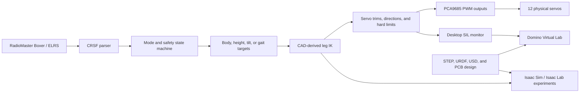

# Domino Engineering Overview

Domino is a custom ESP32 quadruped built to explore the complete path from
mechanical design to a controllable physical robot. The project combines a
carbon-and-printed composite chassis, a twelve-servo leg system, a custom
CRSF/ExpressLRS radio link, CAD-derived inverse kinematics, a desktop firmware
test harness, a browser-based 3D sandbox, and an Isaac Sim / Isaac Lab research
track.

This is a work-in-progress engineering prototype. The repository is intended
to make the design, reasoning, code, and current limitations inspectable. It is
not yet a measured production BOM or a finished step-by-step build kit.

## The Interesting Problem

A quadruped is not just four servo-controlled arms. Domino's lower legs use a
compact closed-chain linkage, so several things have to agree at once:

- CAD pivot locations and link lengths.
- Coordinate-frame conventions.
- Servo horn orientation, trim, and direction.
- Reachable foot positions and mechanical limits.
- Receiver switch state and failsafe behavior.
- Simulation joint topology and contact behavior.

The project is interesting because those concerns are kept in one development
loop. A change to the body pose or gait has to pass through kinematics, servo
mapping, software-in-the-loop checks, and eventually physical bring-up.

## System At A Glance



The important design choice is that the high-level firmware is the control
authority. The SIL build compiles the production firmware against simulated
Arduino hardware, while the Domino Virtual Lab browser application visualizes the
resulting commands. This avoids maintaining a separate JavaScript copy of the
robot controller that could quietly drift from the ESP32 version.

## Mechanical Design

Domino uses a long central composite cage rather than a closed decorative body.
Printed parts locate the servos, pivots, PCB, and electronics, while carbon
members provide stiffness across the longer body spans. The open structure is
deliberate: it keeps the receiver, PCB, servo harnesses, and linkage hardware
accessible while the robot is being tuned.

Each corner has three driven degrees of freedom:

1. Hip abduction/adduction at the shoulder.
2. Upper-leg pitch.
3. The lower linkage or knee drive.

The robot therefore has twelve actuator channels in total. The lower mechanism
is visually and mechanically closer to a four-bar or closed-chain assembly
than a simple serial three-link arm. Several visible bars are passive members;
they should follow their pin joints rather than being treated as independent
motors.

The current hardware target uses high-torque 40 kg-class servos at the four
shoulders and 35 kg-class DSservo units for the remaining leg drives. Those are
mechanical design inputs, not a substitute for measured stall-current,
temperature, or loaded gait testing.

The current CAD reference package contains the full assembly, body, and
individual leg exports under [`cad/step`](../cad/step). The mechanical design
notes explain which exports to start with and how CAD changes affect the
firmware constants: [`cad-design.md`](cad-design.md).

## Coordinate Frames And Kinematics

The body frame uses `+X` forward, `+Y` to the robot's left, and `+Z` upward.
The leg solver works from the hip rotation centre and uses a downward leg-frame
`+Z`. Body pose commands are converted into hip-to-foot targets before they
reach the single-leg inverse kinematics function.

The main geometry constants are derived from the CAD neutral pose rather than
chosen as generic SpotMicro dimensions. The current model uses the effective
leg lengths and linkage offsets in [`src/ik.cpp`](../src/ik.cpp), while
[`src/main.cpp`](../src/main.cpp) owns the body geometry, neutral foot layout,
ride-height range, and gait targets.

The pipeline is intentionally explicit:

```text
body/foot target
    -> hip-relative leg target
    -> 3-DoF inverse kinematics
    -> servo angle and direction mapping
    -> trim and hard-limit enforcement
    -> PCA9685 pulse output
```

[`src/leg_controller.cpp`](../src/leg_controller.cpp) is where the geometry
solution becomes hardware-safe output. The PCA9685 channel table is not simply
`leg * 3`: the physical wiring includes a non-contiguous channel assignment,
including the front-right lower channel on PCA9685 channel 15. Keeping that
mapping in one place makes hardware changes easier to audit.

## CRSF / ExpressLRS

Replacing the earlier iBUS-style receiver path with CRSF was one of the main
technical goals of Domino. The robot uses the same kind of binding workflow as
an ExpressLRS FPV setup, but the ESP32 has to decode and validate the receiver
stream itself before a switch can move twelve servos.

[`src/crsf.cpp`](../src/crsf.cpp) and [`src/crsf.h`](../src/crsf.h) handle:

- 420000-baud `Serial2` input.
- CRSF frame synchronisation and length checks.
- DVB-S2 CRC8 validation.
- Packed `0x16` RC channel frames.
- Sixteen packed 11-bit channels.
- Conversion to the firmware's 1000-2000 microsecond-style range.
- Filtering and link timeout state.

The current channel contract is:

| Channel | Role | Firmware behavior |
| --- | --- | --- |
| CH1 | Roll | Body roll in tilt mode. |
| CH2 | Pitch / forward | Body pitch in tilt mode; forward or reverse gait command while walking. |
| CH3 | Ride height | Continuous height control from the Boxer left-stick vertical axis. |
| CH4 | Yaw / turn | Body yaw in tilt mode; differential turn command while walking. |
| CH5 | Stand | Stand or stow request. |
| CH6 | Reserved | Currently unbound. |
| CH7 | Walk selector | Stand, careful walk, or trot selection through the three-position switch. |
| CH8 | Tilt interlock | Enables tilt and blocks gait while active. |

The reusable parser example is in
[`examples/crsf-esp32-reader`](../examples/crsf-esp32-reader), with the
standalone extraction published as
[ESP32_CRSF_Reader](https://github.com/Blacksheep909/ESP32_CRSF_Reader).

## Firmware Control Loop

The firmware runs a deliberately small and inspectable control loop at a 20 ms
interval. Each cycle:

1. Reads and validates CRSF input.
2. Updates link-health and failsafe state.
3. Debounces mode switches and applies the gait/tilt interlock.
4. Ramps ride height and other commanded transitions.
5. Selects stow, stand, tilt, balance, careful walk, or sinusoidal gait.
6. Builds body and foot targets.
7. Solves each leg and writes all twelve servo outputs.

The safety behavior is distributed across the same path rather than bolted on
after the motion code:

- Startup begins in a compact stow target.
- Stand movement is ramped instead of applying a full pose step.
- Switches use debounce and hysteresis to reduce mode chatter.
- Tilt blocks gait rather than allowing both behaviors to write outputs.
- Servo outputs are constrained by per-channel limits.
- Link loss moves the robot toward a stow target.
- The IMU balance experiment cancels itself at excessive measured tilt.

The output layer is still servo-position control, not closed-loop torque or
current control. The limits reduce software-commanded travel; they cannot make
an incorrectly assembled mechanism safe by themselves.

## Details Worth Inspecting

Several small implementation choices are useful examples beyond the headline
features:

- The CRSF reader performs bit-level unpacking of sixteen 11-bit channels and
  rejects frames whose DVB-S2 CRC does not match.
- The CAD servo branch reconstructs passive pivot locations through 2D circle
  intersections and an assembly-orientation preference, which is a more useful
  model of the linkage than simply rotating every visible bar independently.
- Servo mapping keeps neutral terms, direction signs, trims, and hard limits
  explicit. That makes an unusual physical channel assignment reviewable and
  keeps a proven neutral pose from moving when calibration gains change.
- The gait uses filtered command slew and smooth endpoint motion. This is a
  practical way to reduce shock and touchdown slip before adding a more capable
  balance controller.
- The SIL monitor records the actual production firmware's pulse outputs, so a
  reviewer can inspect the decision that would reach the PCA9685 rather than a
  separate visual approximation.

## Gait And Balance Experiments

The first gait is a deliberately slow diagonal sinusoidal trot. Front-left and
back-right share one phase, while front-right and back-left use the opposite
phase. The stride uses smooth half-cosine motion and a raised return arc so
horizontal velocity approaches zero at touchdown and liftoff. Command slew,
stride, lift, and frequency are intentionally conservative while the linkage is
being validated.

The careful-walk mode is a slower support-biased experiment with a longer
three-foot support window. It exists to make the first physical gait easier to
inspect and to provide a less aggressive test case than the normal trot.

Tilt and balance are separate experiments. Tilt maps the sticks into a body
orientation request, while balance uses filtered MPU6050 roll and pitch to
apply conservative per-leg height corrections. Neither should be described as
a finished dynamic stabiliser yet; the current engineering priority is
keeping foot targets, linkage geometry, and mode transitions coherent.

## Software-In-The-Loop

[`simulation/sil`](../simulation/sil) builds the production `src/main.cpp`,
CRSF parser, IK, trim tables, mode logic, and servo safety limits as a desktop
program. Only the hardware boundary is replaced:

- simulated `Serial2` receives generated valid CRSF frames;
- simulated MPU6050 data supplies gravity/orientation samples;
- a simulated PCA9685 records the exact twelve pulse outputs; and
- deterministic time makes safety scenarios repeatable.

This is a strong part of the project because it tests the same firmware that
will run on the ESP32. It is useful for checking startup stow, CRSF decoding,
mode debounce, ride height, gait output, tilt interlock, link loss, and finite
servo pulses before servo power is connected.

```powershell
.\simulation\sil\test.ps1
.\simulation\sil\launch.ps1
```

SIL is not contact physics. It answers "what commands did the firmware issue?"
It does not answer "did the CAD linkage collide, touch the floor, or support the
body?" That distinction is why the Isaac and Virtual Lab tracks remain useful.

## Domino Virtual Lab

The Virtual Lab is a local computer-game-like inspection tool. It combines the
production firmware with:

- all 29 Domino CAD STL meshes;
- Boxer USB joystick or keyboard input;
- CRSF-style channel generation;
- a 120 Hz Rapier physics loop;
- floor, obstacle, friction, and foot-contact handling;
- an orbit camera and axis navigation; and
- live channel, firmware, contact, linkage, and debug telemetry.

Launch it with:

```powershell
.\simulation\standalone\launch.ps1
```

The important current boundary is documented rather than hidden: the browser
renders Domino's actual CAD, but its collision model is still a simplified
twelve-joint proxy while the exact closed-chain contact model is being tuned.
This makes the Virtual Lab useful for radio mapping, firmware modes, commanded
poses, travel limits, and gross contact behavior, but it is not yet a substitute
for the detailed Isaac mechanism model or a guarantee of physical behavior.

## Isaac Sim / Isaac Lab Track

The Isaac work starts from the actual CAD export path:

- STEP source geometry under [`cad/step`](../cad/step);
- generated URDF reference assets under
  [`simulation/urdf/generated`](../simulation/urdf/generated);
- USD and USDZ exports under [`simulation/usd`](../simulation/usd); and
- Isaac import, linkage, environment, and policy experiments under
  [`simulation/isaac`](../simulation/isaac).

The difficult part is the same mechanical feature that makes Domino
interesting: the real leg is not a clean URDF tree. The Isaac experiments use
explicit pin-joint and closure handling where needed, validate one leg before
scaling to four, and expose all twelve driven channels to the policy path.

The current Isaac material demonstrates asset import, linkage calibration,
actuator sweeps, teacher/reference playback, contact checks, and early PPO
experiments. It should still be described as research infrastructure rather
than a finished autonomous walking policy. A policy that reproduces a verified
mechanism trajectory is a valuable integration checkpoint, but it is not the
same thing as a policy that has independently learned robust locomotion.

The detailed runbook and current gates are in
[`simulation/isaac/README.md`](../simulation/isaac/README.md).

## PCB And Electronics

Domino uses an ESP32 DevKit as the controller and a PCA9685 as the twelve-way
servo PWM layer. The receiver, logic supply, IMU, servo power path, and utility
headers are kept accessible inside the central electronics cage.

The first Domino prototype reused the older SpotMicro ESP32 Nitro PCB. Adding
the CRSF receiver was a small practical modification: receiver power, ground,
and TX were routed into the ESP32 serial input used by the firmware. The newer
Domino PCB V1.1B keeps the same core architecture while adding headers,
improving connector and silkscreen layout, and addressing issues found on the
older board.

The manufacturing package and PCB screenshots are under
[`hardware/pcb/domino-quadruped-pcb-v1.1b`](../hardware/pcb/domino-quadruped-pcb-v1.1b).
Servo power must remain separate from logic power, with a common ground and a
regulator/BEC sized for realistic servo stall current.

## Code Tour

These are the files worth opening when reviewing the project:

| File | Why it is interesting |
| --- | --- |
| [`src/main.cpp`](../src/main.cpp) | The complete behavior state machine, body pose model, height control, tilt, balance, gait, interlocks, and failsafe path. |
| [`src/crsf.cpp`](../src/crsf.cpp) | A self-contained CRSF frame parser with CRC and packed-channel decoding. |
| [`src/ik.cpp`](../src/ik.cpp) | The leg inverse-kinematics math and CAD-derived geometric assumptions. |
| [`src/leg_controller.cpp`](../src/leg_controller.cpp) | Physical PCA9685 mapping, servo signs, trims, travel limits, and output conversion. |
| [`src/imu.cpp`](../src/imu.cpp) | MPU6050 acquisition and filtered orientation state. |
| [`simulation/sil/src/sil_main.cpp`](../simulation/sil/src/sil_main.cpp) | The simulated hardware boundary around the production firmware. |
| [`simulation/standalone/server.mjs`](../simulation/standalone/server.mjs) | Boxer HID input, firmware process control, state snapshots, and debug recording. |
| [`simulation/standalone/web/src/physics.js`](../simulation/standalone/web/src/physics.js) | Rapier proxy bodies, contacts, servo motors, and the real-time sandbox loop. |
| [`simulation/isaac/prototypes/pin_linkage/domino_cad_linkage_builder.py`](../simulation/isaac/prototypes/pin_linkage/domino_cad_linkage_builder.py) | CAD pivot extraction and explicit closed-linkage construction for Isaac experiments. |
| [`hardware/pcb/domino-quadruped-pcb-v1.1b`](../hardware/pcb/domino-quadruped-pcb-v1.1b) | The board package that connects the mechanical and firmware architecture to real hardware. |

## What Is Complete And What Is Not

### Strong current deliverables

- A buildable ESP32/PlatformIO firmware project.
- A reusable CRSF/ESP32 reader example and separate reader repository.
- CAD-derived geometry, real assembly STEP exports, and PCB manufacturing files.
- A twelve-servo mapping with trims, directions, and software travel limits.
- Deterministic SIL scenarios using the production controller sources.
- Domino Virtual Lab, a 3D CAD environment for pre-hardware input and mode testing.
- Isaac import, closed-linkage, actuator, contact, and policy research tooling.

### Still in progress

- A measured BOM and complete wiring diagram.
- Printed-part orientations, fasteners, bearings, inserts, and rod lengths.
- A validated public build manual.
- A fully validated closed-chain physics model for Domino Virtual Lab.
- Dynamic balance and a robust learned locomotion policy.
- Hardware validation of every mode across the full mechanical envelope.

The honest status is part of the portfolio value: the repository shows the
engineering process, including where a literal CAD import or a visually good
simulation is not yet enough to claim physical correctness.

## Suggested Review Path

1. Inspect the [master project photo](images/domino-master.jpg) and the CAD
   overview in [`cad-design.md`](cad-design.md).
2. Read [`crsf.md`](crsf.md) and open [`src/crsf.cpp`](../src/crsf.cpp) to see
   the radio protocol boundary.
3. Follow the target-to-PWM path through `main.cpp`, `ik.cpp`, and
   `leg_controller.cpp`.
4. Run the SIL safety scenario before connecting servo power.
5. Launch Domino Virtual Lab to exercise Boxer input against the real CAD
   visuals.
6. Use the Isaac runbook only after the one-leg and linkage gates are passing.

## Credits And Safety

Domino's mechanical direction is derived from the ESP32 quadruped work by
[Tazer Technical](https://www.youtube.com/@TazerTechnical). That work was an
important reference for the design direction and build experimentation.

Domino remains a work-in-progress prototype. Test with the robot supported,
servo power disconnected, and one subsystem at a time. Software limits and
simulation reduce risk but do not replace mechanical inspection, correct
wiring, current-capable power hardware, or an operator ready to remove power.
