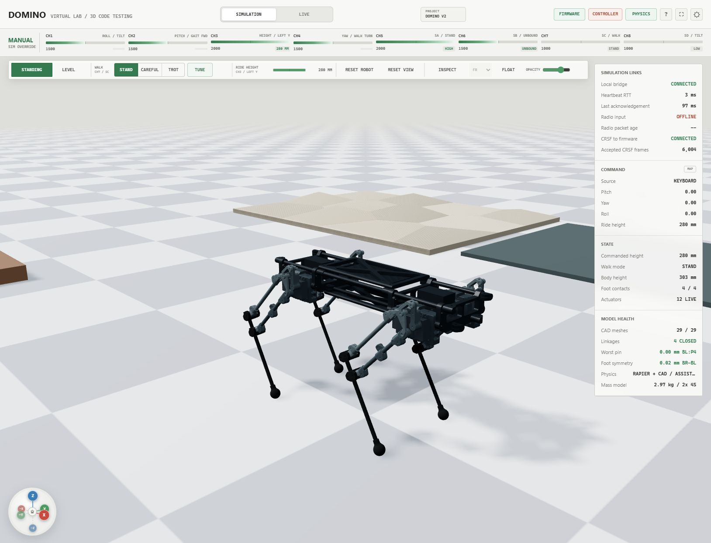

# Domino Quadruped Studio

Domino Quadruped Studio is the project's Windows application for simulation,
robot inspection, calibration, telemetry, gait development and route planning.
It brings the Domino CAD, native firmware simulator, local service and robot
companion tools into one workspace.

**Start here:** [Studio source](https://github.com/Blacksheep909/Domino-ESP32-Quadruped/tree/codex/desktop-app/simulation/standalone)
· [Windows releases](https://github.com/Blacksheep909/Domino-ESP32-Quadruped/releases)
· [Project home](../README.md)



*An actual screenshot of the Studio 0.3.1 development build, with the simulated
robot standing at a commanded height of 280 mm and four ground contacts. The
connection indicators in this view belong to the local simulator.*

## Availability

Studio is developed on the repository's `codex/desktop-app` branch. At the time
of this guide, that public branch contains version 0.2.26; the screenshot and
the sections marked **0.3 development** show the newer local 0.3.1 build.
Check the branch's `package.json` and release notes for the features included
in the build you install.

Windows installers use `Domino-Quadruped-Studio-<version>-x64.exe`. Portable
builds use the corresponding `.zip`. No public GitHub installer release is
listed yet; the source-build instructions below are the available public route.
The installed application bundles its runtime dependencies, so ordinary use
does not need a separate Node terminal.

## Start with Simulation

1. Open Studio. Each launch starts in **SIMULATION**.
2. Use **SITTING / STANDING** to change the model's pose. Allow the firmware
   transition to finish before changing modes again.
3. Adjust **RIDE HEIGHT** and try **LEVEL / TILT** to inspect body movement.
4. Use **RESET VIEW** to frame the robot. Drag the 3D view to orbit and scroll
   to zoom. **INSPECT** adds joint and linkage information; **FLOAT** removes
   ground contact for mechanism inspection.
5. Use **TUNE** to explore gait parameters. **STAND**, **CAREFUL** and **TROT**
   select the simulator's walking modes. Evaluate a profile here before taking
   it to the hardware workflow.
6. Use **PROJECT** to save a `.qstudio.json` configuration in a normal folder.

The **?** button lists the current keyboard shortcuts. USB gamepads and
compatible RadioMaster/EdgeTX/OpenTX transmitters can also supply input. **MAP**
opens per-controller axis, inversion, deadzone and response settings. A CRSF
transmitter keeps its own channel routing.

The model combines the actual CAD and linkage geometry with Rapier physics and
the production control firmware compiled for the computer. **RAPIER + CAD /
ASSISTED** identifies the current contact model. Simulation is useful for pose,
input, linkage and gait development; the physical dog still requires load,
clearance, power and walking validation.

## Workspaces and tools

| Workspace / tool | What it does | What it needs |
| --- | --- | --- |
| **Simulation** | CAD motion, firmware modes, terrain/contact model, keyboard/controller input, gait tuning and joint inspection. | Local simulator; works without a robot. |
| **LIVE → Compare** | Expected and reported pose, body/joint differences, link health, power, safety state and recording. | A compatible robot adapter for live values. |
| **LIVE → Data** | Larger time-aligned graphs, sample inspection and CSV/JSON capture export. | Robot telemetry or a recorded session. |
| **LIVE → GPS / LIDAR** | Mission map, local routes, map overlays, GPS tracks, LiDAR sectors, geofence settings and vehicle-adapter controls. Older builds call this page **Sensors**. | Local planning works offline; live sensors and vehicle actions require advertised capabilities. |
| **LIVE → Calibration** | Five-step joint setup, profile readback, electrical channel mapping, offsets, direction, mechanical limits and backups. | Local drafts work offline; physical jog/save requires an acknowledged bench session. |
| **LIVE → Gaits** | Local profile library, animated preview, parameter checks, comparison with the robot's active profile, apply and rollback. | A compatible disarmed robot for persistent changes. |
| **LIVE → Diagnostics** | Input-to-output pipeline, packet freshness, CRSF/ELRS health, counters, events and diagnostic export. | A robot stream for physical evidence. |
| **LIVE → Sessions** | Saved captures, import/export, baseline/candidate metrics and trend comparisons. | Recorded or imported session data. |

**Simple / Expert** changes the amount of visible engineering detail. Light and
dark themes apply to the app controls, maps, graphs and inspection panels.

## Connecting a physical robot

Select **LIVE**, then **PAIR ROBOT**. Choose the supported transport and adapter
and inspect the reported robot identity, firmware and capabilities. Pairing
establishes a read-only PC link; physical actions have their own acknowledgements
and readiness checks.

**DRIVE LINK** describes the robot's controller/radio evidence. **PC LINK**
describes the computer's telemetry/companion connection. One can be available
while the other is missing. Waiting fields remain unavailable until fresh data
arrives from the selected adapter.

**MANUAL CONTROL** is a separate physical-control workflow. It uses an explicit
authority lease, hold-to-drive input, fresh telemetry and robot-side expiry.
The operator must complete the hardware bring-up procedure before using it.
The detailed engineering procedure is maintained with the
[Studio source documentation](https://github.com/Blacksheep909/Domino-ESP32-Quadruped/blob/codex/desktop-app/docs/live-hardware-bring-up.md).

With ordinary hobby servos, reported servo angles can be commanded output
angles. They are not automatically encoder measurements of the actual shaft.
Body attitude requires a working sensor stream; the current physical prototype
can run without a gyro, so IMU fields may remain waiting. The app does not infer
force or joint-position feedback from a successful command.

## Calibration: preserve the robot's existing profile

The calibration page separates an editable local draft from the active profile
read from the robot. A useful inspection workflow is:

1. Establish a compatible disarmed connection and read the robot's profile.
2. Export a robot-profile backup before making physical changes.
3. Select one joint and check its displayed output channel and electrical
   neutral. Keep the robot's saved routing, trims and directions as the reference.
4. Use the model preview to inspect the joint's travel and the configured stops.
5. Review any intended profile changes before explicitly saving to the robot.

Opening the page, selecting a joint and moving a model preview do not rewrite
the robot's calibration. **SAVE BROWSER COPY** saves a local draft; **SEND TO
ROBOT** is a separate physical action. Importing a project or profile also
produces local configuration for review.

### Interactive inspection — 0.3 development

The selected joint has a readable screen overlay with CAD pose, estimated servo
angle, allowed travel, distance to each stop and limit status. **FOCUS JOINT**
frames the selection; **FULL ROBOT** returns to the whole mechanism. Double-click
a model part to select its corresponding output.

**VISUAL TRAVEL TEST** scrubs the model angle. **PLAY SWEEP** animates within the
configured limits. The **VISUAL PREVIEW NUDGE** buttons make relative 1 or 0.1
degree changes from the pose currently shown, including a scrubbed pose.
Physical neutral-trim controls require the bench workflow.

The presentation follows the firmware's existing planar drive correction while
preserving each saved electrical output identity and neutral. A changed joint
label is not a request to swap wires or replace the saved calibration.

**CAD PROXIMITY SCREEN** reports broad bounding-box proximity. It helps spot a
potential conflict in the model but cannot certify real mechanical clearance.

## Motion smoothing — 0.3 development

Calibration's review step includes **MOTION RESPONSE / RAMP**. The graph shows a
requested pose step and the rate-limited command sent toward IK. Select roll,
pitch, yaw or height, change the example move, and inspect the rate, movement
per 20 ms control tick and time to target.

| Setting | Meaning |
| --- | --- |
| Motion smoothing on/off | Enables or bypasses pose ramps and the tilt-center deadband. |
| Stand height | Maximum height-command change in mm/s. |
| Tilt roll / pitch / yaw | Maximum change for that body axis in degrees/s. |
| Tilt center deadband | Small stick-center region ignored before the remaining input is rescaled. |

The current implementation is a linear rate limit. Lower rates soften abrupt
commands and take longer to reach the target. Disabling smoothing passes the
new target on the next control update. The graph is a command preview rather
than a measurement of servo movement.

Ramp shaping is not PID feedback. External PID would need a useful measured
quantity, such as body attitude or actual joint position; the servo's own
internal position loop does not provide that measurement to Studio. Saving
smoothing settings to the robot requires compatible firmware and the page's
disarmed save/readback checks. Changing the graph's example move stays local.

## Maps and navigation

Local route planning works without a GPS fix. Add, name, move and reorder
waypoints; inspect route distance and loops; preview the plan; and save or export
it. The map has zoom, pan, a distance scale and selectable route, GPS, LiDAR,
fence and vehicle overlays.

A geographic origin binds local metres to latitude/longitude. Enter coordinates
or search a place, then review and set the origin. OpenStreetMap tiles and place
search need network access; local grid planning remains available offline.
**USE DEVICE** requests the computer's location permission. Street View opens
an external map view for the selected area or waypoint.

GPS and LiDAR displays use fresh adapter telemetry. Adding a map origin does
not create a robot GPS fix. Native Domino route execution requires the robot's
navigation/control capabilities and current safety checks. The current
prototype's GPS/LiDAR hardware path still needs physical integration and
validation. ArduPilot/MAVLink adapter controls operate only on a compatible
connected vehicle; an offline preview sends no vehicle command.

## Projects, captures and updates

- **Projects:** `.qstudio.json` bundles supported calibration, gait, controller
  and route configuration. Save/open uses native dialogs in the desktop app.
- **Captures:** Data and Sessions hold recorded telemetry, graph it and export
  portable files. This is separate from configuration projects.
- **Runtime state:** Arm, E-stop, bench acknowledgement, connection sessions,
  control authority and active route execution are excluded from project saves.
  A reload starts in Simulation with a fresh connection workflow.
- **App updates:** NSIS `.exe` builds update the same installation. Published
  releases supply the desktop updater; portable `.zip` copies are updated
  manually. An app update does not automatically flash the ESP32 or overwrite
  its saved calibration.
- **Firmware:** **UPLOAD FW** opens the firmware review/build/upload workflow.
  Building firmware and uploading it are explicit separate steps.

## Build and run from source

The current source launcher targets Windows. Install Git, Node.js, pnpm,
Python and PlatformIO, and make their commands available in PowerShell.
The desktop release workflow uses Node 24.

```powershell
git clone --branch codex/desktop-app https://github.com/Blacksheep909/Domino-ESP32-Quadruped.git
cd Domino-ESP32-Quadruped
pio pkg install --global --tool platformio/toolchain-gccmingw32
.\simulation\sil\build.ps1
cd simulation\standalone
pnpm install --frozen-lockfile
pnpm run desktop:make
```

The installer and portable build are written to `simulation/standalone/out`.
Use `pnpm run desktop:start` in that directory for desktop development.

For the local browser workflow, return to the repository root and run:

```powershell
.\simulation\standalone\launch.ps1
```

The launcher builds/starts the native simulator and local service. Open
`http://127.0.0.1:8770`. Start both processes; a renderer alone cannot run the
firmware simulation. Stop the source session with:

```powershell
.\simulation\standalone\stop.ps1
```

## Common checks

| Symptom | Check |
| --- | --- |
| Simulation pose stays in transition | Confirm the native SIL process is running and its state is updating; use the source launcher rather than starting only the Node service. |
| Radio says offline with keyboard input | Expected: keyboard input is separate from a physical CRSF transmitter. |
| LIVE values show waiting | Inspect PC link, selected adapter, packet freshness and advertised capabilities. |
| Calibration/save/jog buttons are unavailable | Inspect disarmed state, bench acknowledgement and adapter support; model-only preview remains separate. |
| Map tiles do not load | Check network access and a reviewed geographic origin; use the local grid offline. |
| A graph says measured but no joint sensors exist | Check the telemetry source: commanded servo output is not independent position feedback. |

For deeper implementation detail, see the
[Virtual Lab guide on the Studio branch](https://github.com/Blacksheep909/Domino-ESP32-Quadruped/blob/codex/desktop-app/docs/virtual-lab.md)
and [application source](https://github.com/Blacksheep909/Domino-ESP32-Quadruped/tree/codex/desktop-app/simulation/standalone).
