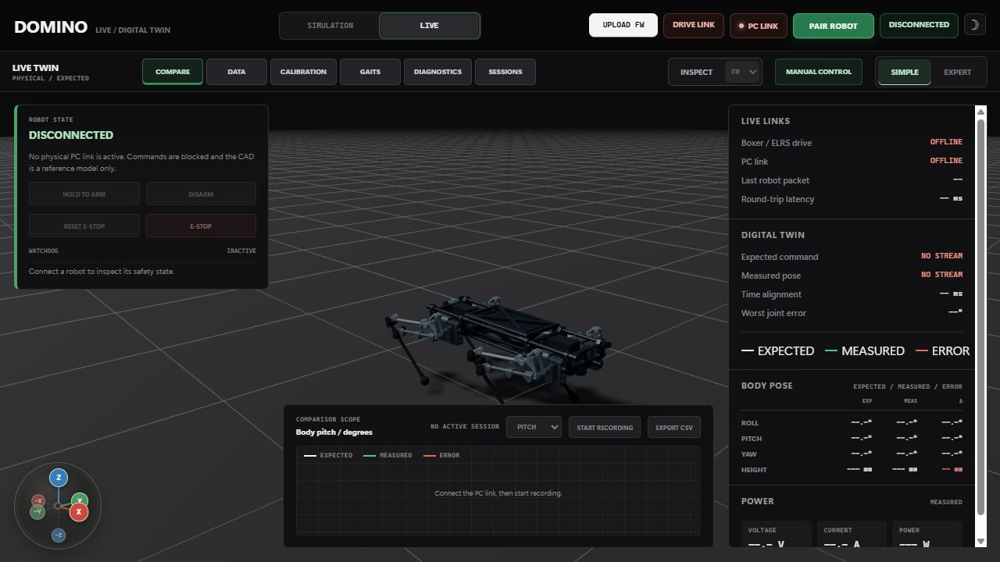
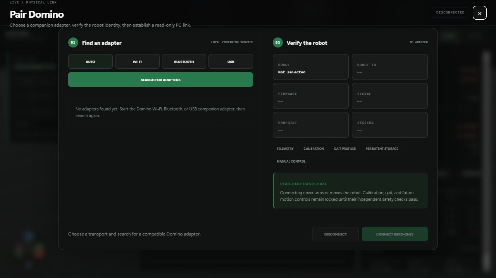
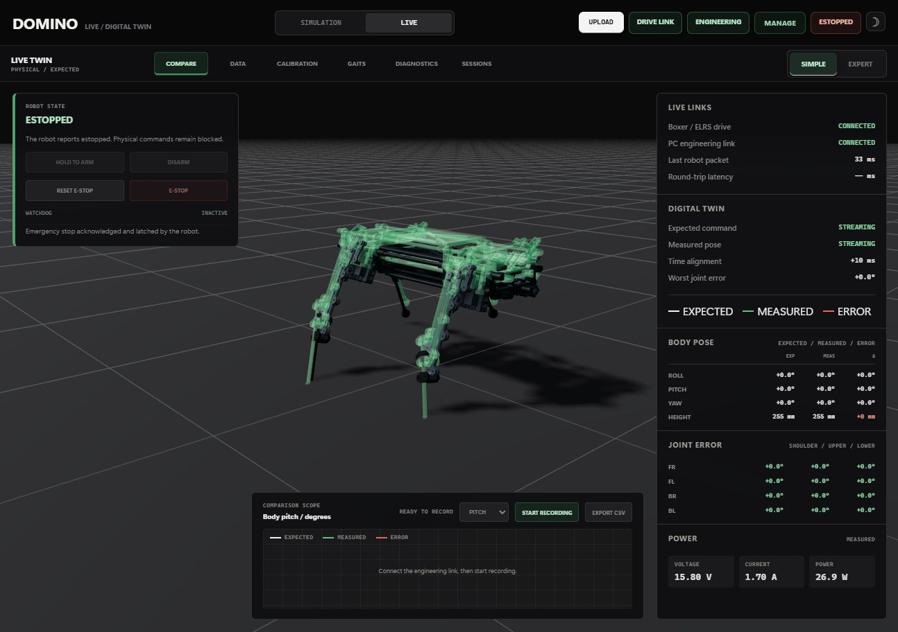
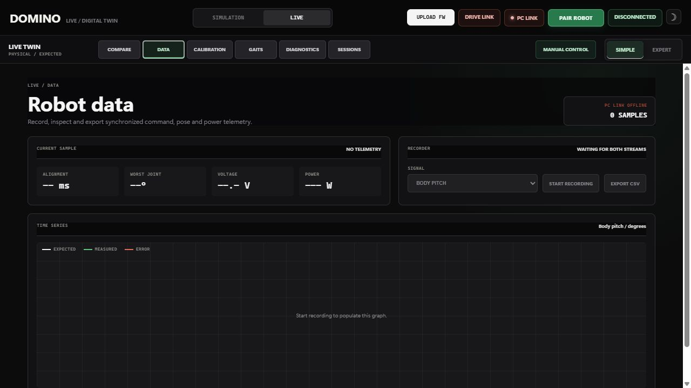
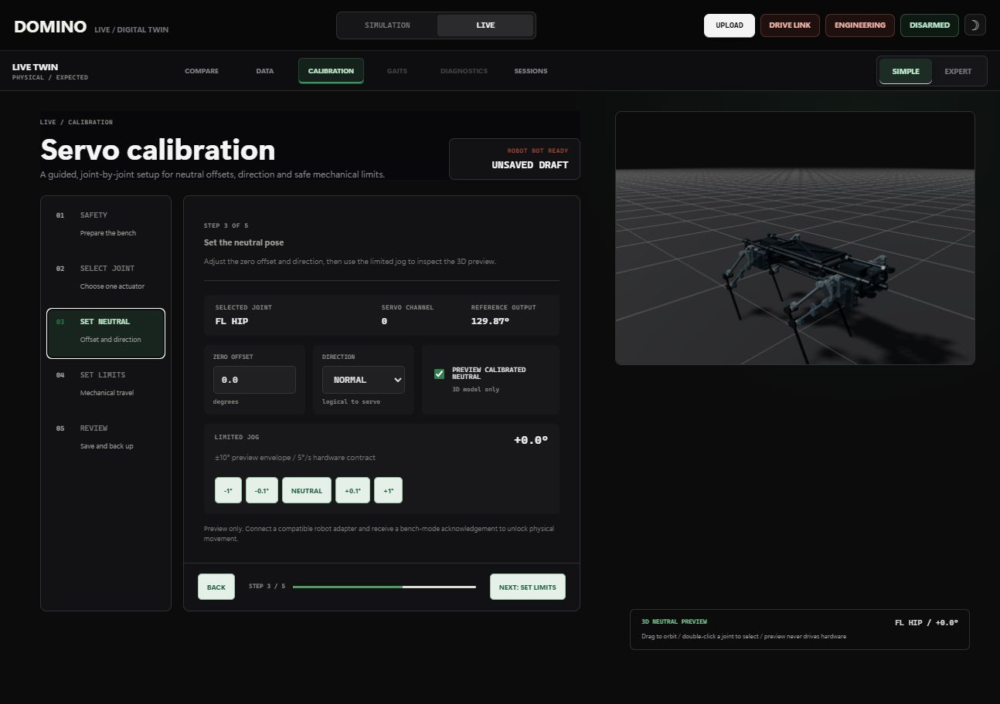
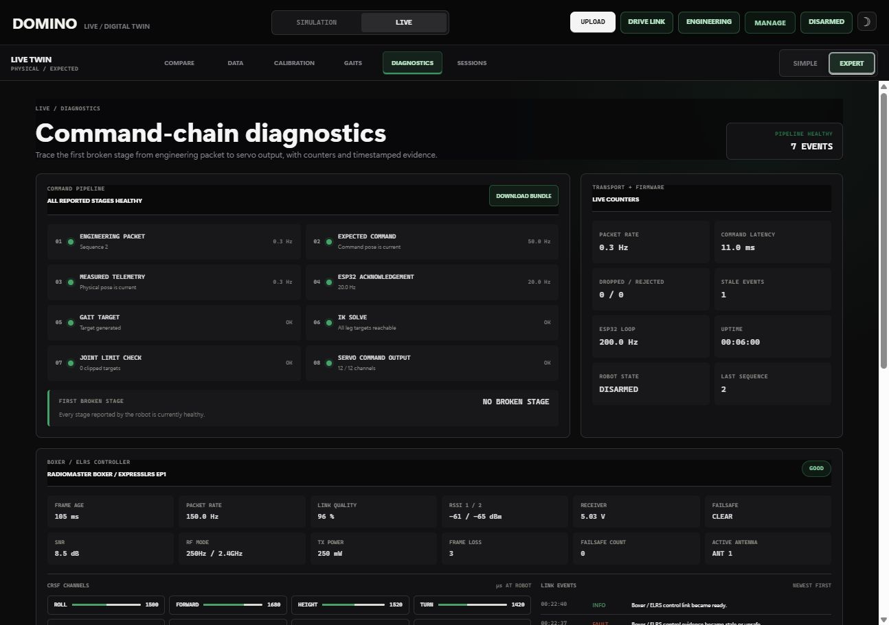
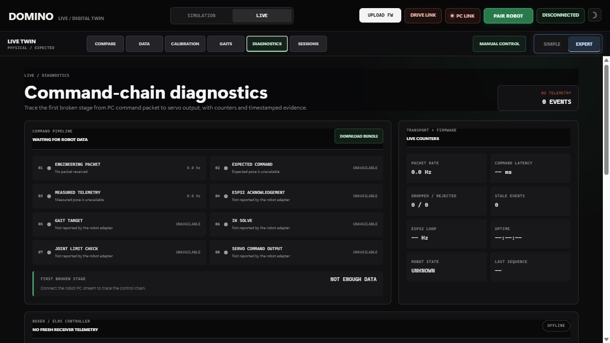
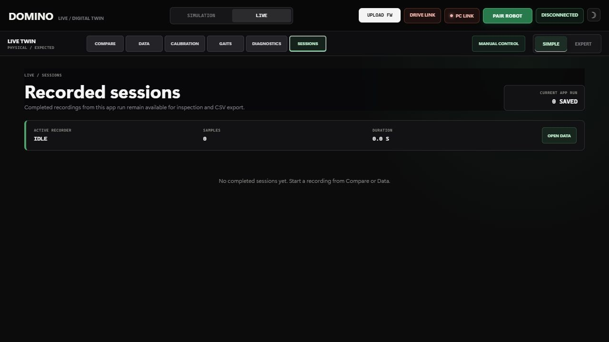

# Domino Virtual Lab

The Domino Virtual Lab is a local engineering application for developing the
quadruped's firmware, mechanism, controls, and future physical-robot tooling.
It is source code that runs from this repository. It is not a hosted GitHub
Pages site and does not require an internet connection after dependencies are
installed.

## Workspaces

### Simulation


The Simulation workspace combines the production control firmware compiled as
a native process with the actual Domino CAD, a closed-linkage solver, Rapier 3D
physics, CRSF transmitters, keyboard and configurable gamepads, gait tuning, joint
inspection, and session recording.

Simulation is the place for unrestricted gait experimentation. Its connection
indicators refer only to the local firmware bridge, controller, and physics
runtime; they do not claim that the physical dog is connected.

The link panel keeps those signals independent. The browser/server heartbeat
shows bridge health, acknowledgement age, and round-trip time. Radio status is
based only on fresh compatible transmitter HID/gamepad packets, while CRSF
status and its accepted-frame count come from the firmware-in-the-loop
controller. Keyboard, ordinary gamepad, or demo input therefore cannot make the
radio indicator appear connected.

Xbox/XInput, DualShock 4, DualSense, and standards-compliant generic gamepads
are identified by name. The Command panel's **MAP** action stores independent
axis, inversion, and button choices for each exact controller identity, making
non-standard USB pads usable without changing source code. CRSF radios bypass
this mapping and preserve their first eight transmitter channels directly.

### Live



The Live real-robot workspace is deliberately separate from Simulation. It opens
disarmed and cannot own simulation controls, firmware state, or physics state.
It keeps the same CAD viewport as a digital-twin surface: commanded geometry
will be shown as the expected pose, physical joint/IMU telemetry as the measured
pose, and the difference as joint, body-pose, timing, and graph errors. Until a
physical PC link exists, measured values remain unavailable rather
than borrowing simulated data.

The current comparison shell includes independent DRIVE LINK and PC LINK
health, expected/measured stream state, body-pose deltas, all 12 joint errors,
power measurements, and a synchronized comparison scope. The physical telemetry
contract now accepts independently timestamped expected and measured poses,
computes shortest-path angular errors, and rejects malformed, out-of-order, or
stale packets. Fresh measured telemetry drives a separate translucent CAD model
over the expected pose; the overlay disappears if the stream is more than one
second old. A transport-neutral connection manager now discovers companion
adapters, shows robot identity, firmware, signal, endpoint, and capabilities,
then negotiates an explicit read-only PC link.




Every accepted adapter must maintain a heartbeat. Telemetry, calibration, and
gait traffic is bound to the selected adapter and negotiated session; stale
adapters, mismatched session packets, duplicate adapter identities, and
unsolicited acknowledgements are rejected. Connecting never arms or moves the
robot, and losing either the local bridge or adapter heartbeat immediately
relocks hardware commands.

The repository now includes a runnable physical companion process for Wi-Fi
TCP, USB serial, and Bluetooth SPP serial links. It reconnects the browser relay
and robot independently, refuses a read-only session until the robot has sent a
fresh state, and waits for physical acknowledgements instead of treating a
successful write as a successful action. Setup and the robot-side wire contract
are documented in [LIVE companion protocol](live-companion-protocol.md).

The LIVE safety dock now reflects the robot-reported state and implements an
independent safety command protocol. Arming requires a continuous 1.5-second
hold while the PC link, expected/measured telemetry, and robot-side
CRSF/ELRS drive link all remain fresh. Arm, disarm, E-stop, and E-stop reset do
not update optimistically: the UI waits for a session-bound robot
acknowledgement and preserves the reported state on rejection or timeout.



While armed, the browser sends a 10 Hz safety heartbeat and requires robot
acknowledgements inside a 400 ms window. Leaving LIVE, hiding the browser,
losing the local bridge, or losing the adapter stops that heartbeat; the
physical adapter must independently disable outputs when its watchdog expires.
The screenshot above verifies the protocol with a synthetic adapter, not a
powered robot. A physical E-stop remains the primary power-isolation control.


The comparison scope records each synchronized source pair once and graphs body
pitch, roll, yaw, or height as expected, measured, and error series. A telemetry
interruption creates a visible gap without ending the session or reusing stale
values. Stopped sessions export analysis-ready CSV containing timestamps, time
alignment, body pose, power, and all 12 driven-joint errors. The screenshot
above uses local relay verification data, not a connected physical robot.

The LIVE navigation has six working views. Compare keeps the digital twin,
pose deltas, power readings, and compact scope together. Data provides a larger
signal graph, recorder controls, live robot metrics, and a newest-first
table of synchronized samples. Sessions keeps completed recordings in a local
IndexedDB archive across app reloads, summarizes duration, sample count, peak
joint error, and average power, and gives every session independent CSV export
and delete actions. The archive validates restored records and retains the 20
newest sessions, with the same 18,000-sample bound used by the recorder. If
durable browser storage is unavailable, the page says `MEMORY ONLY` rather than
claiming persistence.

Two saved runs can be selected as baseline and candidate. The comparison panel
calculates mean pitch error, P95 joint error, average power, integrated energy,
minimum voltage, and peak current, then marks candidate deltas as improvements
or regressions. Its normalized-time chart overlays pitch, roll, yaw, height
error, or power so runs with different durations can still be inspected side by
side. Raw samples remain available through each session's CSV export.
Recording state is shared across all three views, so moving between them cannot
interrupt or split a capture.



The current offline capture above shows the complete Data layout without
inventing telemetry. Once both expected and measured streams are fresh, the
same view fills the graph, metrics, and Expert sample table from synchronized
records.

Calibration is a five-step workflow covering bench safety, selection of all 12
wired joints, neutral offset and direction, conservative mechanical limits, and
profile review. It provides a dedicated 3D neutral-pose preview, supports visual
joint selection by double-clicking the model, bounds preview jogging to 10
degrees, stores a browser copy, and imports/exports versioned JSON backups.

The calibration preview opens in a floating, floor-free presentation so joint
motion is easier to inspect without implying that the model is carrying body
weight. The small suspended-chassis icon beside the preview caption toggles the
floor back on when stance context is useful. This switch is visual only: it does
not enter robot bench mode, move a servo, or replace the requirement to support
the physical chassis before calibration.

The Select Joint step also opens a dedicated physical channel-map editor. A
logical joint can be routed to any PCA9685 channel from 0-15, which supports
robots whose cable layout differs from the compiled Domino defaults. Duplicate
outputs are rejected. The editor shows a before/after list and requires an
explicit physical-wiring acknowledgement; persistent robot apply has a separate
confirmation. The firmware keeps joint calibration attached to the logical
mechanism, routes PWM to the selected physical output, energizes only one output
during bench jog, and turns all outputs off before activating a new map.




Physical movement and robot persistence are deliberately locked until a robot
adapter acknowledges bench mode, safe jogging at no more than 5 degrees per
second, and persistent profile storage. The localhost relay validates this
command/acknowledgement contract, and firmware 0.6.0 now enforces it on USB,
Wi-Fi TCP, and Bluetooth SPP transports.

Gaits is now a separate LIVE profile-transfer workspace. It shares the same
versioned profile library and JSON format as the Simulation gait lab, but edits
remain a local draft until explicitly applied. A moving 3D kinematic preview,
reachability result, parameter-by-parameter robot comparison, and bounded risk
warnings make the differences visible before hardware is involved.


The apply path requires the adapter to advertise persistent-profile support and
report the robot disarmed. The relay validates a two-stage apply contract and
firmware 0.6.0 validates all ten numeric bounds again with every output off.
The ESP32 writes the candidate into the inactive NVS slot, reads back and
checksums it, then atomically changes the active slot. The prior verified slot
remains available for explicit rollback. Active robot settings are included in
LIVE telemetry so the comparison view reflects what the controller is actually
running.

Diagnostics traces eight stages from the PC command packet through expected and
measured poses, ESP32 acknowledgement, gait target, IK, limit checking, and all
12 servo outputs. It reports packet rate, latency, missing/rejected/stale packet
counters, ESP32 loop rate, uptime, robot state, and the last sequence number.
The first fault is called out directly, while state transitions are captured in
a severity-filtered event log. Expert mode adds the last packet and command
inspectors. A diagnostic bundle exports those stages, recent events, packet
summary, active recording summary, and current calibration profile as JSON.

The controller section separately validates the robot-side CRSF / ExpressLRS
path. Simple mode shows the eight active controls, CRSF frame age and rate,
link quality, dual RSSI, receiver voltage, and failsafe state. Expert mode adds
all 16 channels, SNR, RF mode, transmitter power, active antenna, cumulative
frame loss and failsafe counts, plus a timestamped transition log.



The drive badge and hold-to-arm prerequisite require fresh bounded
`crsf-radio` controller telemetry (with legacy `boxer-elrs` compatibility) with failsafe clear, at least 50% link
quality, and RSSI no worse than -105 dBm. A legacy boolean cannot make the link
look ready. Controller telemetry and its event history are included in the
downloadable diagnostic bundle, while rejected packet bursts are counted
without flooding the event log.

The LIVE toolbar also exposes guarded browser manual control without hiding the
normal radio path. The page can be opened offline to inspect the workflow, but
the robot must explicitly grant a session-bound, maximum 30-second authority
lease before the deadman becomes available. Forward, turn, gait mode, and the
Expert body controls remain bounded; frames transmit at 20 Hz only while HOLD
TO DRIVE is held and declare a 250 ms robot-side timeout. Pointer/keyboard
release sends neutral stand immediately. Hiding the tab, leaving LIVE, losing a
safety prerequisite, disarming, or losing the adapter revokes the browser
authority. The E-stop remains available inside the control window.

Firmware 0.6.0 enforces that contract on the ESP32 as well as in the companion.
It independently checks the authority token, maximum lease, monotonic sequence,
deadman, axis bounds, armed state, and CRSF link. A missing frame neutralizes
within 250 ms, while disarm, watchdog, lease expiry, controller failure, or
release revokes the override. Browser stand, careful, and trot use the same
production motion path as the radio; Expert height and body roll remain bounded.

The expected 3D pose is intentionally not driven optimistically from local
slider values. It continues to follow robot-reported expected telemetry, so the
display distinguishes what the browser requested from what the robot actually
accepted and intended to execute.



The screenshot above deliberately injects missing packets, low voltage, an IK
failure, joint clipping, and missing servo channels through the local relay. It
does not represent a connected physical robot.

Simple mode will present the normal operating workflow. Expert mode will expose
the detailed signals and settings needed for mechanism, gait, power, and
control optimization. Safety limits remain active in both modes.



Sessions is intentionally quiet before a recording exists. Completed captures
remain available in the same browser after restarting the application and can
be compared, inspected, or exported without reconnecting the robot.

## Current architecture

The local application runs three cooperating pieces:

1. The browser renders the UI, CAD and physics environment.
2. The local Node server owns HID input, command arbitration, session logs,
   firmware build/upload operations, and browser communication.
3. The SIL executable runs the same C++ controller used by the ESP32 and
   publishes its commanded poses, joint angles, PWM outputs, and state.

The physical implementation will keep two independent wireless paths:

- ExpressLRS/CRSF for driving, essential telemetry, and an operator stop;
- ESP32 Wi-Fi for high-rate engineering telemetry, calibration, profiles,
  logs, graphs, and diagnostics.

The manager also reserves Bluetooth and USB adapter types for setup, recovery,
or bench use. These transports publish the same canonical session-bound
envelopes, so the browser tools do not need transport-specific safety logic.

## Run locally

The current launcher targets Windows. Install Node.js, pnpm, Python/PlatformIO,
and the PlatformIO MinGW toolchain, then run:

```powershell
cd simulation\standalone
pnpm install
cd ..\..
pio pkg install --global --tool platformio/toolchain-gccmingw32
.\simulation\standalone\launch.ps1
```

Open `http://127.0.0.1:8770`. Stop both local processes with:

```powershell
.\simulation\standalone\stop.ps1
```

## Verification

Run the standalone unit, linkage, gait, heartbeat, control-state,
firmware-package and physics tests with:

```powershell
cd simulation\standalone
pnpm test
```

The generated `dist/`, `node_modules/`, and `runtime/` directories are ignored.
Only the source, lockfile, launch scripts, tests, documentation, and required
robot assets belong in Git.

## Documentation media

Repository screenshots live under `docs/images/`. Capture screenshots after
meaningful interface milestones. Short GIFs should demonstrate one focused
interaction - such as switching workspaces, opening the gait lab, inspecting a
joint, or recording a session - and remain short enough to be practical in the
repository.
