# Domino Virtual Lab

The Domino Virtual Lab is a local engineering application for developing the
quadruped's firmware, mechanism, controls, and future physical-robot tooling.
It is source code that runs from this repository. It is not a hosted GitHub
Pages site and does not require an internet connection after dependencies are
installed.

## Current desktop release

Domino Quadruped Studio `0.2.1` is the primary distribution. The Windows
installer bundles the same frontend source used by the local browser build,
along with the local service, CAD assets, firmware SIL, and companion adapter.
Use the desktop installer for normal operation and updates; use the browser
launcher as the secondary source-development path.

The current LIVE UI uses one shared visual system across all seven views:
consistent title banners, readable telemetry labels, contained controls, and a
responsive preview lane that keeps navigation status panels below the title
area. The Sensors view labels the IMU panel as **Attitude reference** and keeps
its guidance focused on measured orientation, Inspect/Float behavior, and the
available leg selection. The browser and packaged app are built from the same
frontend so these UI changes do not diverge between them. Switching LIVE tools
also returns the selected page to its title so each view opens with the same
predictable layout. At compact widths, the Sensors, Calibration, and Gaits
previews occupy a reserved block below the title and collapse while scrolling
so they never cover telemetry or navigation cards.

The Simulation control strip follows the same layout rule: its pose, walk,
height, reset, and inspection groups use shared tracks at desktop widths and
wrap into intentional rows on compact windows. Controls remain fully visible
and the gait-tuning panel starts below the strip instead of covering it.

### Native route planning

The LIVE Sensors view now includes a Domino-owned top-down route planner. Click
the map to place waypoints, adjust the planning range, reorder or remove points,
duplicate a waypoint when shaping a patrol, and export the plan as JSON. Plans created before a GPS fix use a local north/east
metre frame and retain that frame through import/export; once a GPS or home
reference is available, new points also carry georeferenced coordinates. Use
**REFERENCE LOCAL PLAN** to deliberately bind an existing offline draft to the
active home position; the control stays disabled until that reference exists.
Waypoint names are editable in each point card, so operators can use labels such
as `DOCK`, `GATE`, or `CHARGE` instead of relying on numeric markers alone.
The collapsed **AUTONOMY ACTIVITY** panel keeps a bounded newest-first record
of route starts, pauses, safety stops, manual handoffs, and ArduPilot
acknowledgements for operator review.
**EXPORT LOG** saves that bounded timeline with the current local mission context;
the same record is included in the diagnostic JSON bundle, while connection,
arm, authority, and active execution state remain excluded from local persistence.
The current draft, route name, map range, obstacle policy, and geofence settings
are also autosaved locally and restored on the next launch. This convenience
record never includes connection, arm, authority, or vehicle-execution state.
Use **EXPORT LIBRARY** and **IMPORT LIBRARY** in the saved-routes drawer to move
the bounded named-route collection between desktop installs; importing replaces
only the saved library and never changes the active draft or vehicle state.
For interoperability with mapping tools, **EXPORT GEOJSON** writes the current
route as a standard GeoJSON feature collection. It includes an ordered line,
individual waypoint features, and Domino metadata for labels, speed, arrival
radius, dwell time, loop count, and the local map origin. Local-only drafts are
converted through the active origin and are refused when no origin is available,
so an export cannot silently invent geographic coordinates. **IMPORT GEOJSON**
accepts ordered Point features or a LineString/MultiLineString, bounds the
result to 100 waypoints, and leaves the imported route behind the normal review,
geofence, and vehicle-command gates.
The recent GPS trail can be cleared or turned into a bounded local route with
**CREATE PLAN FROM TRACK**. The action keeps the first and last fixes,
resamples long trails, and leaves the resulting draft behind the same review,
geofence, and vehicle-command gates as any hand-planned route.

For a repeating patrol, set **LOOPS** to 1x, 2x, 3x, or 5x. This is a
Domino-owned route setting: the planner previews each pass, includes the
closing leg back to the first waypoint in distance and ETA, and the guarded
native runner starts each next pass at waypoint one. Return Home remains a
separate one-shot safety action, and every loop still passes the same fresh
sensor, geofence, lease, and neutral-on-fault checks. The app-owned controller
checks the home-radius fence before its arrival-radius check, so a waypoint
cannot be accepted merely because the dog is close to a target outside the
permitted area.
When more than one loop is selected, the map also draws that closing leg as a
dashed return segment so the patrol shape is visible before it is previewed.
When a live GPS trail is available, the map draws it as a quiet blue dotted
line beneath the planned route so the operator can compare the dog's actual
path with the plan.
The map also includes a compact legend with an honest GPS-track state and a
scale reference that updates with the selected planning range.
When the obstacle guard is enabled and the LiDAR stream is fresh, four muted
clearance sectors appear around the vehicle marker and change color at the
stop and slow thresholds; stale or bypassed LiDAR is shown explicitly in the
legend.
**CENTER DOG** recenters the map on the current GPS position, or on the active
offline preview position. **FOLLOW DOG** keeps that display center attached to
the moving position while previewing; it is a view-only convenience and never
rewrites route coordinates or sends a vehicle command. Both controls stay
disabled until a usable position is available.

The compact Domino Autonomy HUD stays beside the map and shows a complete,
compact route/pass summary, position quality, current heading, next-point
distance, total route distance, a conservative time estimate, and front
obstacle distance. The map vehicle marker rotates to the fresh GPS course or
the current offline-preview segment, and its accessible label reports the
heading when one is available. The route checklist calls out
whether the plan is empty, still local, outside the active home-radius
geofence, or ready for GPS upload. When a home reference and radius are active,
the planner draws that safety boundary and marks out-of-bounds waypoints before
they can pass the route gate. Clicking or keyboard-selecting a waypoint marker
selects its editable row, and dragging a marker repositions it in the active
local planning frame while keeping the GPS conversion synchronized. A focused
marker also supports the Delete key plus 0.5 m arrow-key nudges (Shift moves
5 m); each edit records the same undoable change as the row action. **OPEN
MANUAL OVERRIDE** opens the existing guarded manual-control handoff
at any time. Sending a plan to a vehicle remains a separate, explicit action:
local planning works offline, while physical route execution remains closed
until the selected vehicle adapter, position, EKF, obstacle policy, geofence,
and safety checks all report ready.

Each waypoint also has two deliberately different actions. **DRIVE** runs only
to that selected point through Domino's guarded native controller, which is
useful for testing or recovering a route without executing the rest of the
draft. **GUIDE** is the explicit ArduPilot handoff for that point. Neither
action bypasses the connection, safety, freshness, heading, obstacle, or
geofence gates.

**PREVIEW ROUTE** runs the draft entirely in the Domino planner: it animates
the local vehicle marker through each segment using waypoint speeds and holds,
repeats the selected bounded loop count, and never sends a vehicle command.
This gives operators a quick route sanity check before choosing the separate
vehicle upload/start actions.

**START DOMINO ROUTE** is the app-owned execution path for a compatible Domino
adapter. It uses the existing time-limited manual-control lease to stream
bounded forward/turn axes, so the route decision remains in this program
instead of being handed to ArduPilot. The button unlocks only when the adapter
advertises `nativeNavigation` and `manualControl`, the robot is armed, both
telemetry streams are fresh, GPS heading and position are valid, LiDAR is
fresh when obstacle guard is enabled, and the route passes the home-radius
fence. A stale sensor, fence breach, disarm, link loss, hidden tab, or lease
expiry sends neutral and blocks the route. **OPEN MANUAL OVERRIDE** immediately
neutralizes and releases the route lease. The current ESP32 firmware does not
advertise `nativeNavigation` yet because its physical GPS/LiDAR adapter still
needs to be integrated and validated.

**PAUSE DOMINO ROUTE** sends a neutral hold while retaining the route index and
lease; **RESUME DOMINO ROUTE** rechecks every gate before motion continues.
**RETURN HOME** is a separate Domino-owned mode: it targets the active home
origin without changing the saved mission draft, and uses the same guarded
lease, sensor freshness, geofence, and neutral-on-fault rules.
Waypoint dwell times are honored by the Domino runner as well; pausing during a
dwell preserves the remaining hold time before the route advances.

The preview controls also support **PAUSE**, **RESUME**, and one-second
**STEP** inspection, with selectable 0.5x, 1x, 2x, and 4x playback rates.
Stopping a preview marks it as stopped and requires an explicit restart; a
completed preview remains visible until the operator starts it again.

During planning and preview, the HUD also shows the output of Domino's native
navigation controller. It turns the active local target, vehicle heading,
front LiDAR range, and home-radius fence into a bounded forward/turn intent,
adds a bounded left/right clearance bias, and reports `SENSOR WAIT`,
`OBSTACLE STOP`, or `GEOFENCE STOP` when a safe intent cannot be produced.
This is deliberately an app-owned decision layer;
physical execution is capability-gated until a native adapter implements and
advertises the corresponding robot-side contract.

**FIT ROUTE** selects the smallest available 40/80/160 m planning range that
keeps the current local draft readable with margin. It is a display convenience
only and does not change waypoint coordinates or vehicle state.

When detailed waypoint work needs more room, **FOCUS MAP** temporarily expands
the Sensors planning lane across the available workspace and hides the shared
3D/camera preview until focus is closed. It is only a presentation mode: the
autonomy HUD, route data, safety checks, and command gates remain unchanged.
Press **ESC** or **EXIT MAP FOCUS** to return to the normal twin-preview layout;
switching to another LIVE page also closes focus automatically.

Click a waypoint marker or its editor row to keep the active waypoint visible
in both places; the selected marker uses a brighter ring while its editor row
is highlighted.

Scroll the planning map, use the **− / +** zoom buttons beside the range
selector, or focus the map and press **+ / −** to move through the bounded
40/80/160 m ranges. Pointer zoom stays anchored near the cursor and never
changes waypoint coordinates; every zoom path keeps the range selector
synchronized.
Hold **Shift** or use the middle mouse button while dragging an empty area of the
planning map to pan the local view;
use **RESET MAP** to return to the local origin. Panning only changes the
displayed map center, never the route coordinates. **CENTER DOG** moves the
display to the current GPS/preview position, while **FOLLOW DOG** keeps that
position centered during an active preview or fresh GPS fix.
The **CURSOR POSITION** strip below the map reports the pointer's local east/north
offset in metres. After an origin is set, it also reports the corresponding
latitude and longitude, making precise route review possible even without a GPS
fix on the robot.
When planning away from the robot, **USE DEVICE** requests the computer's
browser location and fills the map-origin field for review before **SET ORIGIN**
is applied. This is a local planning convenience only; it does not connect to,
arm, or move the robot, and manual latitude/longitude entry remains available
when location permission or a device fix is unavailable.

With network access, **SEARCH PLACE / ADDRESS** can look up up to five places
through OpenStreetMap's Nominatim service. Selecting a result only fills the
coordinate field; **SET ORIGIN** is still required before the map reference or
route coordinates change. Search failure, no results, and offline use all fall
back to manual coordinate entry.

The **LAYER** selector keeps **LOCAL GRID** as the offline-safe default. With a
valid map origin, **OPEN MAP** overlays OpenStreetMap tiles beneath Domino's
planned route, GPS track, LiDAR sectors, geofence, and vehicle marker. The
**OVERLAYS** controls can temporarily hide any of those route, track, LiDAR,
fence, or vehicle layers when the planning surface gets busy; their visibility
is a local presentation preference and never changes the mission or safety
state. The map shows visible OpenStreetMap attribution and caches the visible
tile grid while the operator pans or follows the dog; tile access is
best-effort and should respect the provider's caching and usage policy.
**STREET VIEW** is an explicit external inspection handoff: **OPEN STREET
VIEW** launches a Google Maps URL at the same origin without requiring an API
key. Street View navigation is not read back into the app, so route edits
remain deliberate and happen in the Domino planner after returning from the
external panorama.

**REVERSE ROUTE** reverses the waypoint order for a return pass while retaining
each point's speed, radius, hold, label, and coordinate data. It is an in-app
edit, so it is undoable and still requires the normal route review and safety
gates before any vehicle command.

Route edits can be reversed with the **UNDO** and **REDO** controls beside the
planner, or with **Ctrl+Z**, **Ctrl+Shift+Z**, and **Ctrl+Y** when focus is not in
an editable text field. The history covers waypoint placement, dragging,
reordering, removal, keyboard nudges, range fitting, local-plan referencing,
imports, and draft clears; editing a route also stops an active offline preview so it cannot keep
following stale geometry. The history is an in-memory editing aid and is not
persisted as vehicle state.

From any LIVE view, press **M** or use **MANUAL CONTROL** in the LIVE toolbar to
open the guarded manual-control handoff. Opening it neutralizes an active
Domino route before the operator can request the time-limited manual lease.

The Sensors view also includes a single-front-camera panel for the current
prototype. Enter an HTTP or MJPEG image-stream URL and press **CONNECT**, or
press Enter in the field. A failed stream is labelled **STREAM ERROR** and the
same control becomes **RETRY**; **SNAPSHOT** and **FULLSCREEN** stay disabled
until a frame is connected. Optional robot camera telemetry supplies yaw,
pitch, field of view, frame rate, and stale-state status without pretending
that a video stream exists when the robot has not provided one.

## Workspaces

### Simulation

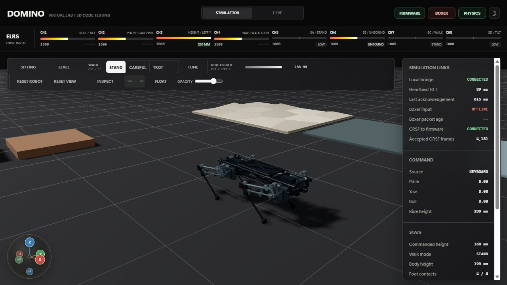

The Simulation workspace combines the production control firmware compiled as
a native process with the actual Domino CAD, a closed-linkage solver, Rapier 3D
physics, CRSF transmitters, keyboard and configurable gamepads, gait tuning, joint
inspection, and session recording.

Simulation is the place for unrestricted gait experimentation. Its connection
indicators refer only to the local firmware bridge, controller, and physics
runtime; they do not claim that the physical dog is connected.

The link panel keeps those signals independent. The browser/server heartbeat
shows bridge health, acknowledgement age, and round-trip time. Radio status is
based only on fresh compatible transmitter HID/gamepad packets, while CRSF
status and its accepted-frame count come from the firmware-in-the-loop
controller. Keyboard, ordinary gamepad, or demo input therefore cannot make the
radio indicator appear connected.

Xbox/XInput, DualShock 4, DualSense, and standards-compliant generic gamepads
are identified by name. The Command panel's **MAP** action stores independent
axis, inversion, button, deadzone, and response-curve choices for each exact
controller identity, making non-standard USB pads and sticks with centre drift
usable without changing source code. CRSF radios bypass this mapping and
preserve their first eight transmitter channels directly.

While the mapping panel is open, a live signal trace shows each selected raw
axis, the value after inversion/deadzone/response shaping, and the resulting
body-roll, forward, or yaw command. This makes controller faults distinguishable
from transport, gait, and servo-output faults without opening developer tools.

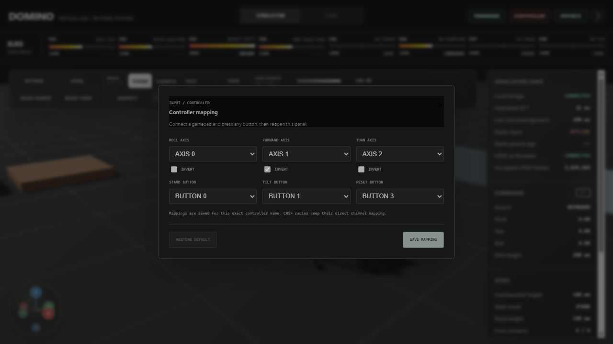

The offline capture keeps Save and Restore disabled because no configurable
gamepad is present. Connecting a non-radio controller enables its own persisted
profile; CRSF transmitters continue to use direct channel routing.

### Live

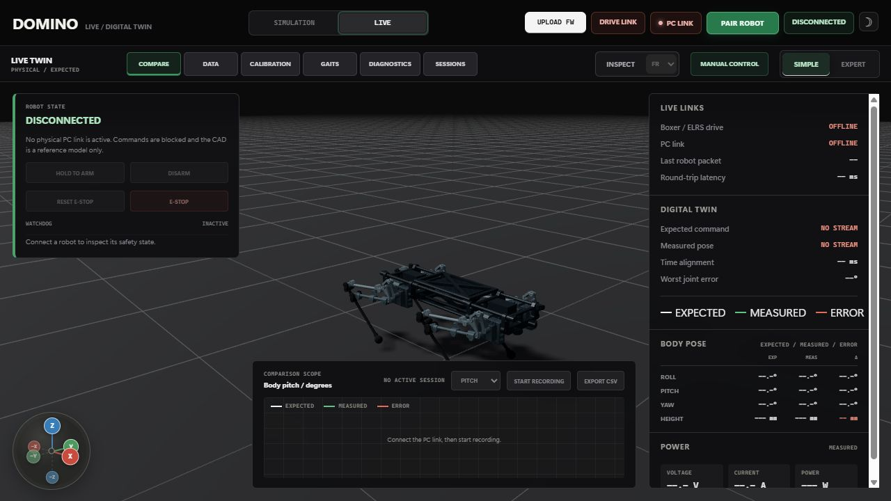

The Live real-robot workspace is deliberately separate from Simulation. It opens
disarmed and cannot own simulation controls, firmware state, or physics state.
Its top bar keeps the measured battery voltage, robot arm state, PC/drive links,
and an acknowledged E-stop visible while moving between every LIVE tool. Battery
telemetry remains unavailable when no physical power sample exists and changes
to a warning state below 14.0 V; it never borrows a simulated value.
For the 4S pack, LIVE also displays total voltage divided by four as **average
cell voltage** and a clearly labelled estimated LiPo charge percentage. The PCB
does not read the balance connector, so these must not be interpreted as four
independently measured cells.
It keeps the same CAD viewport as a digital-twin surface: commanded geometry
will be shown as the expected pose, physical joint/IMU telemetry as the measured
pose, and the difference as joint, body-pose, timing, and graph errors. Until a
physical PC link exists, measured values remain unavailable rather
than borrowing simulated data.

The current comparison shell includes independent DRIVE LINK and PC LINK
health, expected/measured stream state, body-pose deltas, all 12 joint errors,
power measurements, and a synchronized comparison scope. The physical telemetry
contract now accepts independently timestamped expected and measured poses,
computes shortest-path angular errors, and rejects malformed, out-of-order, or
stale packets. Fresh measured telemetry drives a separate translucent CAD model
over the expected pose; the overlay disappears if the stream is more than one
second old. A transport-neutral connection manager now discovers companion
adapters, shows robot identity, firmware, signal, endpoint, and capabilities,
then negotiates an explicit read-only PC link.

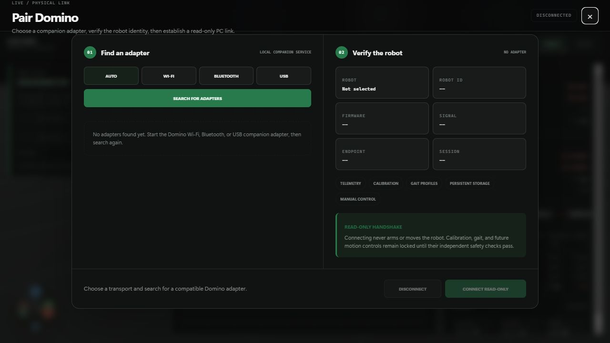

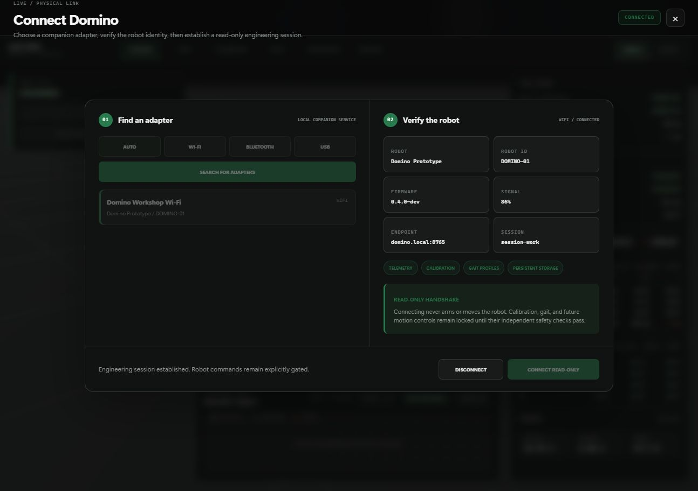

Every accepted adapter must maintain a heartbeat. Telemetry, calibration, and
gait traffic is bound to the selected adapter and negotiated session; stale
adapters, mismatched session packets, duplicate adapter identities, and
unsolicited acknowledgements are rejected. Connecting never arms or moves the
robot, and losing either the local bridge or adapter heartbeat immediately
relocks hardware commands.

After a successfully paired adapter is interrupted, LIVE automatically retries
only that adapter's read-only handshake while every command remains locked. The
connection manager shows a `RECONNECTING` phase with a bounded 1-10 second
backoff countdown. `CANCEL RETRY` forgets the reconnect target without sending
any robot command.

An initial handshake rejection, request timeout, or selected adapter error enters
an explicit connection `FAULT` phase and retains the bounded cause. Search and
read-only retry remain available; an error-reporting adapter cannot start a
handshake. `CLEAR FAULT` acknowledges only this PC-side connection record and
does not clear a robot safety fault, restore a session, or unlock commands.
`RESTART USB` (or the selected transport name) asks the local companion to
close and reopen only its physical robot link, then waits up to eight seconds
for a fresh robot announcement. Commands remain locked throughout recovery;
an unsuccessful restart returns to `FAULT` with the restart control available.

The repository now includes a runnable physical companion process for Wi-Fi
TCP, USB serial, and Bluetooth SPP serial links. It reconnects the browser relay
and robot independently, refuses a read-only session until the robot has sent a
fresh state, and waits for physical acknowledgements instead of treating a
successful write as a successful action. Setup and the robot-side wire contract
are documented in [LIVE companion protocol](live-companion-protocol.md).

The LIVE safety dock now reflects the robot-reported state and implements an
independent safety command protocol. Arming requires a continuous 1.5-second
hold while the PC link, expected/measured telemetry, and robot-side
CRSF/ELRS drive link all remain fresh. Arm, disarm, E-stop, and E-stop reset do
not update optimistically: the UI waits for a session-bound robot
acknowledgement and preserves the reported state on rejection or timeout.

Firmware 0.8.0 also has a latched low-voltage fault path when the optional,
physically calibrated INA226 monitor is enabled. While armed, voltage at or
below the configured 12.8 V critical threshold for 750 ms disables every servo
output and reports the measured cause. Re-arming remains blocked. The operator
can acknowledge the fault only after fresh robot-side power telemetry reaches
the separate 13.6 V recovery threshold; the acknowledgement is rejected if the
sample is missing or the cause remains present. These thresholds are build-time
settings that must be replaced with validated pack limits during bring-up.

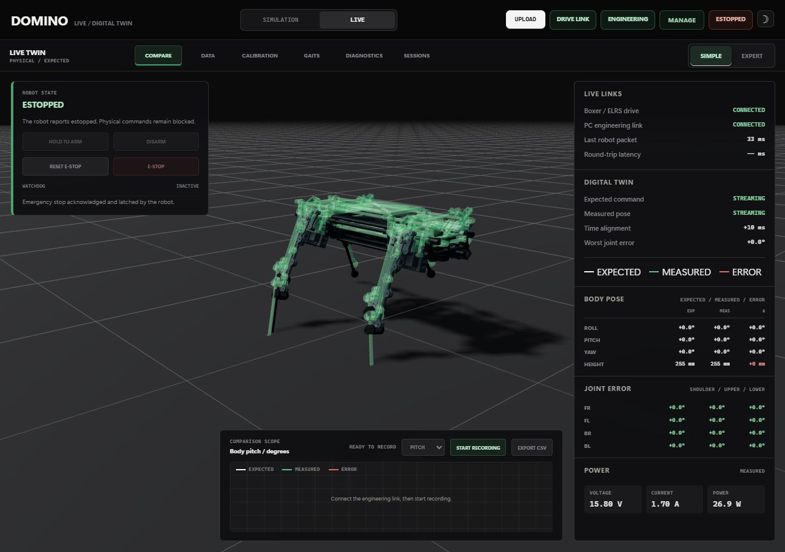

While armed, the browser sends a 10 Hz safety heartbeat and requires robot
acknowledgements inside a 400 ms window. Leaving LIVE, hiding the browser,
losing the local bridge, or losing the adapter stops that heartbeat; the
physical adapter must independently disable outputs when its watchdog expires.
The screenshot above verifies the protocol with a synthetic adapter, not a
powered robot. A physical E-stop remains the primary power-isolation control.

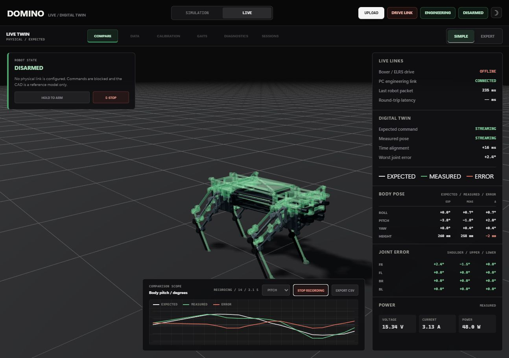

The comparison scope records each synchronized source pair once and graphs body
pose, battery voltage/current/power, command alignment, all four commanded foot
Z targets, or any of the 12 driven-joint angles. Expected, measured, and error
series appear only when the corresponding source exists, so encoderless joints
remain honestly command-only rather than displaying fabricated feedback. A telemetry
interruption creates a visible gap without ending the session or reusing stale
values. Both Compare and Data provide true 10, 30, or 60 second rolling windows
plus a full-session view. Long windows are evenly downsampled for drawing while
preserving their first and last samples; the recorder and exports retain every
bounded raw sample. Stopped sessions export analysis-ready CSV containing timestamps, time
alignment, body pose, power, commanded foot Z, commanded joint angles, and all
12 driven-joint errors. The screenshot
above uses local relay verification data, not a connected physical robot.

The LIVE navigation has seven working views. Compare keeps the digital twin,
pose deltas, power readings, and compact scope together. Data provides a larger
signal graph, recorder controls, live robot metrics, and a newest-first
table of synchronized samples. Sessions keeps completed recordings in a local
IndexedDB archive across app reloads, summarizes duration, sample count, peak
joint error, and average power, and gives every session independent CSV export
and delete actions. The archive validates restored records and retains the 20
newest sessions, with the same 18,000-sample bound used by the recorder. Every
stopped or archived run can be exported either as flat analysis-ready CSV or as
a versioned JSON engineering package. The JSON retains the complete synchronized
sample structure, calculated optimization metrics, and explicit expected versus
measured signal semantics so another tool can reproduce or extend the analysis.
The Sessions page imports the same package after validating its schema, version,
robot identity, timestamps, sample structure, and bounded recording size.
Imported runs enter the same durable archive and baseline/candidate tools, so a
capture can move to another workstation without reconnecting the robot. If
durable browser storage is unavailable, the page says `MEMORY ONLY` rather than
claiming persistence.

Two saved runs can be selected as baseline and candidate. The comparison panel
calculates mean pitch error, P95 joint error, average power, integrated energy,
minimum voltage, and peak current, then marks candidate deltas as improvements
or regressions. Its normalized-time chart overlays pitch, roll, yaw, height
error, or power so runs with different durations can still be inspected side by
side. Raw samples remain available through each session's CSV export.

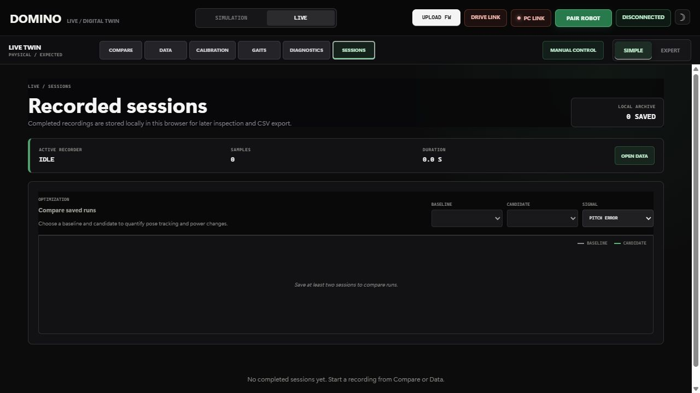

This capture intentionally shows the empty durable archive. The selectors and
chart activate only after two real or verification-adapter recordings exist.
Recording state is shared across all three views, so moving between them cannot
interrupt or split a capture.

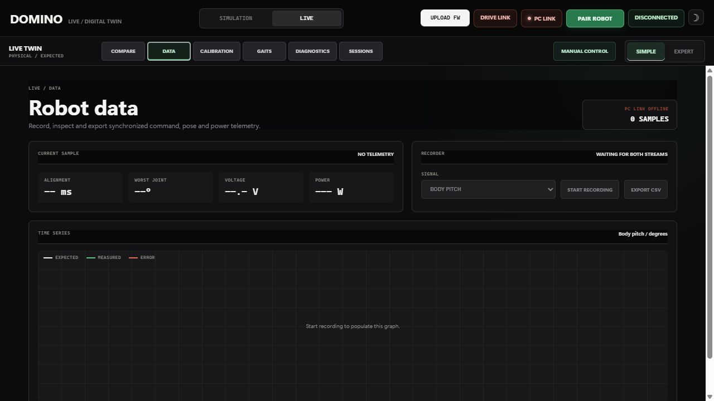

The current offline capture above shows the complete Data layout without
inventing telemetry. Once both expected and measured streams are fresh, the
same view fills the graph, metrics, and Expert sample table from synchronized
records.

Calibration is a five-step workflow covering bench safety, selection of all 12
wired joints, neutral offset and direction, conservative mechanical limits, and
profile review. It provides a dedicated 3D neutral-pose preview, supports visual
joint selection by double-clicking the model, bounds preview jogging to 10
degrees, stores a browser copy, and imports/exports versioned JSON backups.
The operator can restore the selected joint or all 12 joints to the compiled
Domino calibration defaults through an acknowledged local-draft confirmation.
Both actions preserve the physical PCA9685 channel map by default; resetting
that wiring map is a separate, initially unchecked choice during a full restore.
Restore never moves hardware or writes robot storage by itself.

The calibration preview opens in a floating, floor-free presentation so joint
motion is easier to inspect without implying that the model is carrying body
weight. The small suspended-chassis icon beside the preview caption toggles the
floor back on when stance context is useful. This switch is visual only: it does
not enter robot bench mode, move a servo, or replace the requirement to support
the physical chassis before calibration.

The Select Joint step also opens a dedicated physical channel-map editor. A
logical joint can be routed to any PCA9685 channel from 0-15, which supports
robots whose cable layout differs from the compiled Domino defaults. Duplicate
outputs are rejected. The editor shows a before/after list and requires an
explicit physical-wiring acknowledgement; persistent robot apply has a separate
confirmation. The firmware keeps joint calibration attached to the logical
mechanism, routes PWM to the selected physical output, energizes only one output
during bench jog, and turns all outputs off before activating a new map.

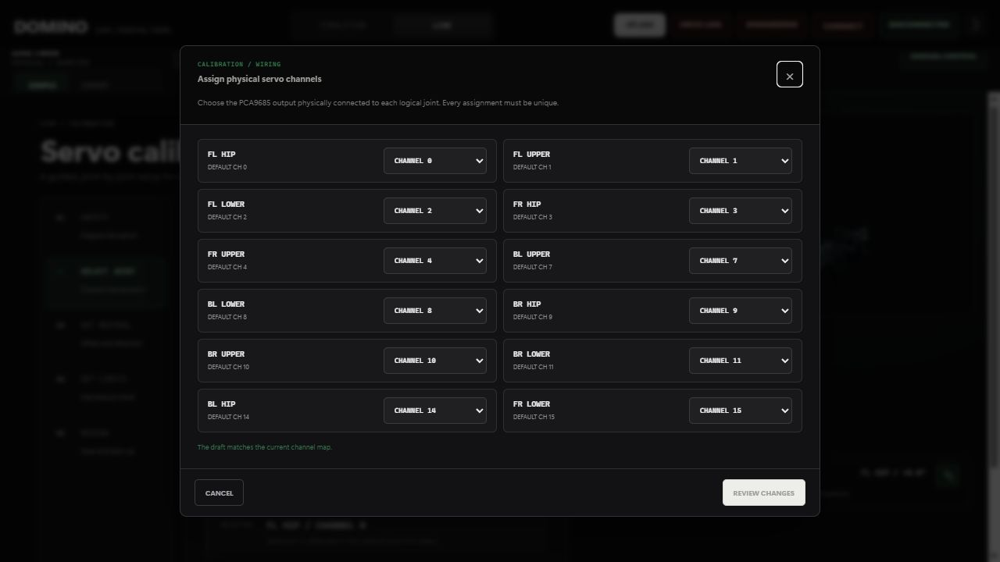

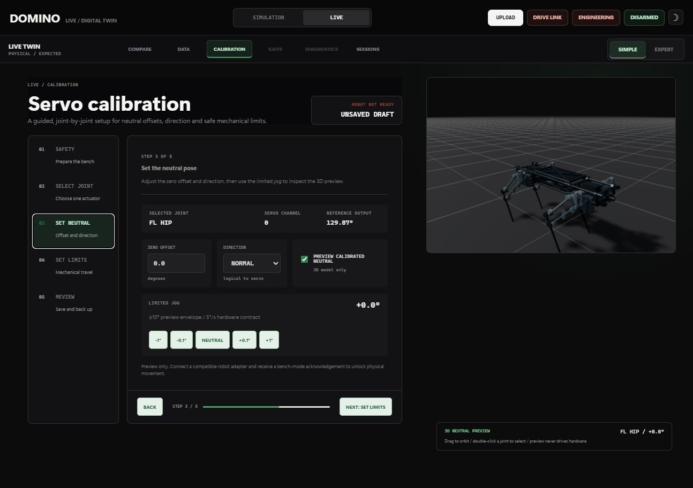

Physical movement and robot persistence are deliberately locked until a robot
adapter acknowledges bench mode, safe jogging at no more than 5 degrees per
second, and persistent profile storage. The localhost relay validates this
command/acknowledgement contract, and firmware 0.8.0 now enforces it on USB,
Wi-Fi TCP, and Bluetooth SPP transports.

Gaits is now a separate LIVE profile-transfer workspace. It shares the same
versioned profile library and JSON format as the Simulation gait lab, but edits
remain a local draft until explicitly applied. A moving 3D kinematic preview,
reachability result, parameter-by-parameter robot comparison, and bounded risk
warnings make the differences visible before hardware is involved.

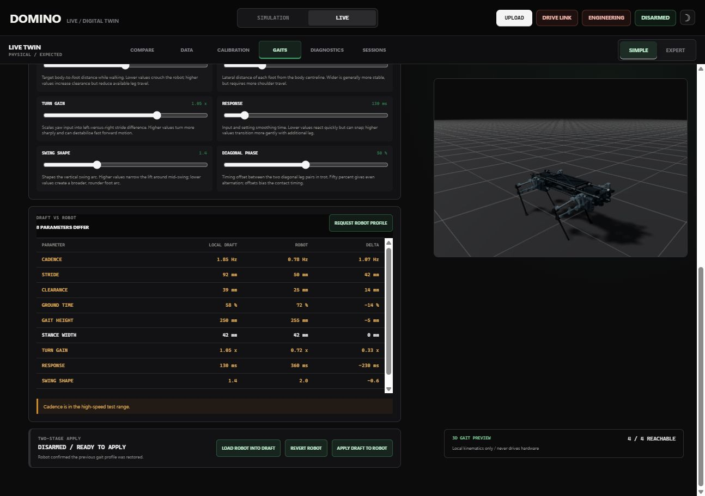

The apply path requires the adapter to advertise persistent-profile support and
report the robot disarmed. The relay validates a two-stage apply contract and
firmware 0.8.0 validates all thirteen numeric bounds again with every output off.
The ESP32 writes the candidate into the inactive NVS slot, reads back and
checksums it, then atomically changes the active slot. The prior verified slot
remains available for explicit rollback. Active robot settings are included in
LIVE telemetry so the comparison view reflects what the controller is actually
running.

Expert mode adds three production-backed bounds rather than browser-only
controls: neutral touchdown X, maximum forward-command scale, and maximum
turn-command scale. They affect both the local CAD preview and the ESP32 gait
loop. Link dimensions remain read-only because changing them without rebuilding
the authored linkage would make the preview and physical mechanism disagree.
Schema-v1 JSON and NVS profiles migrate with preset-specific bounded defaults.

The local preview also feeds a per-leg IK inspector. For every frame it reports
the X/Y/Z foot target, solve validity, q1/q2/q3 commanded delta, stance or swing
state, and any contact with the conservative 45-degree actuator envelope. A
fresh four-leg preview must be reachable and unclipped before Apply Draft is
enabled; changing a profile invalidates the prior assessment until the new
preview has been solved. Robot rollback remains independently available.

Diagnostics traces eight stages from the PC command packet through expected and
measured poses, ESP32 acknowledgement, gait target, IK, limit checking, and all
12 servo outputs. It reports packet rate, latency, missing/rejected/stale packet
counters, ESP32 loop rate, uptime, robot state, and the last sequence number.
The first fault is called out directly, while state transitions are captured in
a severity-filtered event log. Expert mode adds the last packet and command
inspectors. A diagnostic bundle exports those stages, recent events, packet
summary, active recording summary, and current calibration profile as JSON.

The controller section separately validates the robot-side CRSF / ExpressLRS
path. Simple mode shows the eight active controls, CRSF frame age and rate,
link quality, dual RSSI, receiver voltage, and failsafe state. Expert mode adds
all 16 channels, SNR, RF mode, transmitter power, active antenna, cumulative
frame loss and failsafe counts, plus a timestamped transition log.

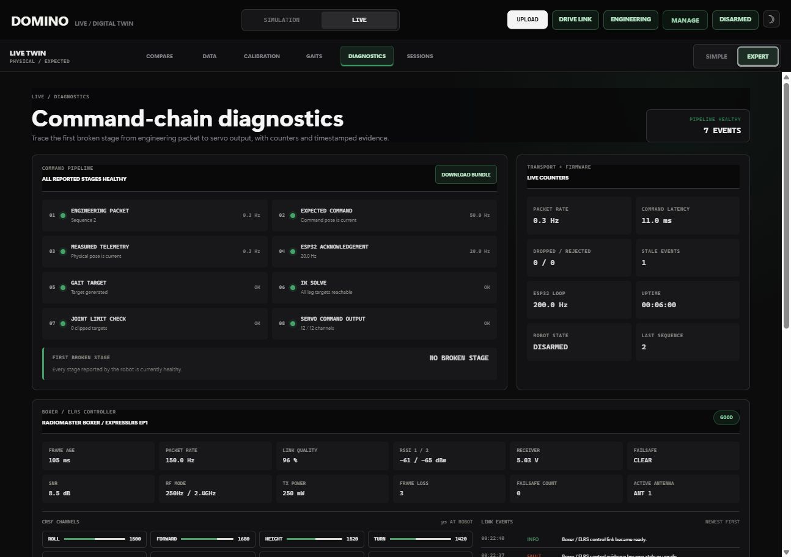

The drive badge and hold-to-arm prerequisite require fresh bounded
`crsf-radio` controller telemetry (with legacy `boxer-elrs` compatibility) with failsafe clear, at least 50% link
quality, and RSSI no worse than -105 dBm. A legacy boolean cannot make the link
look ready. Controller telemetry and its event history are included in the
downloadable diagnostic bundle, while rejected packet bursts are counted
without flooding the event log.

The LIVE toolbar also exposes guarded browser manual control without hiding the
normal radio path. The page can be opened offline to inspect the workflow, but
the robot must explicitly grant a session-bound, maximum 30-second authority
lease before the deadman becomes available. Forward, turn, gait mode, and the
Expert body controls remain bounded; frames transmit at 20 Hz only while HOLD
TO DRIVE is held and declare a 250 ms robot-side timeout. Pointer/keyboard
release sends neutral stand immediately. Hiding the tab, leaving LIVE, losing a
safety prerequisite, disarming, or losing the adapter revokes the browser
authority. The E-stop remains available inside the control window.

Firmware 0.8.0 enforces that contract on the ESP32 as well as in the companion.
It independently checks the authority token, maximum lease, monotonic sequence,
deadman, axis bounds, armed state, and CRSF link. A missing frame neutralizes
within 250 ms, while disarm, watchdog, lease expiry, controller failure, or
release revokes the override. Browser stand, careful, and trot use the same
production motion path as the radio. In Stand, Expert adds independently bounded
body roll and pitch (±8°), yaw (±8°), fore/aft translation (±15 mm), lateral
translation (±12 mm), and ride height. Locomotion turn remains a separate axis,
so rotating the standing body cannot be confused with steering a gait.

The expected 3D pose is intentionally not driven optimistically from local
slider values. It continues to follow robot-reported expected telemetry, so the
display distinguishes what the browser requested from what the robot actually
accepted and intended to execute.

With Inspect enabled in LIVE, selecting a leg and driven joint also shows the
final calibrated microsecond pulse and its mapped PCA9685 output. The value is
captured in firmware after offset, inversion, mechanical limiting, and channel
remapping. It remains labelled as a commanded servo output because Domino does
not currently have joint encoders; the separate output-enabled diagnostic says
whether that command is physically energized.

Recordings preserve those pulse and output-map values for all 12 driven joints.
The Data scope can graph each calibrated PWM command alongside body, power,
timing, foot-target, and joint-angle signals, while CSV exports include both the
microsecond pulse and mapped PCA9685 output per logical joint. This makes a
calibration remap or actuator-demand change visible in later optimization
comparisons instead of losing it when the live packet scrolls away.

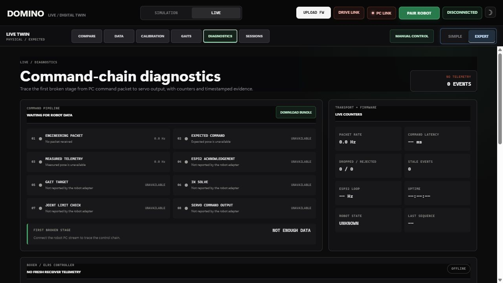

The screenshot above deliberately injects missing packets, low voltage, an IK
failure, joint clipping, and missing servo channels through the local relay. It
does not represent a connected physical robot.

Simple mode will present the normal operating workflow. Expert mode will expose
the detailed signals and settings needed for mechanism, gait, power, and
control optimization. Safety limits remain active in both modes.

Theme, floating-panel geometry, Simple/Expert detail, the last selected LIVE
tool, and calibration float/floor presentation are local user preferences. They
use bounded versioned records and fail back to safe defaults if malformed. A
reload always opens Simulation and never restores connection, arming, E-stop
recovery, bench mode, manual-control authority, or telemetry state.

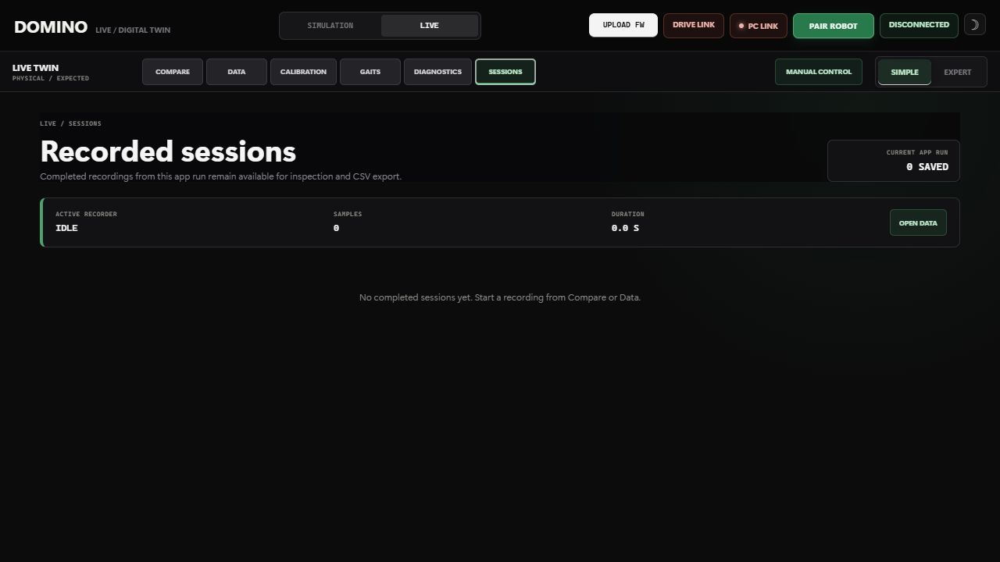

Sessions is intentionally quiet before a recording exists. Completed captures
remain available in the same browser after restarting the application and can
be compared, inspected, or exported without reconnecting the robot.

## Current architecture

The local application runs three cooperating pieces:

1. The browser renders the UI, CAD and physics environment.
2. The local Node server owns HID input, command arbitration, session logs,
   firmware build/upload operations, and browser communication.
3. The SIL executable runs the same C++ controller used by the ESP32 and
   publishes its commanded poses, joint angles, PWM outputs, and state.

The physical implementation will keep two independent wireless paths:

- ExpressLRS/CRSF for driving, essential telemetry, and an operator stop;
- ESP32 Wi-Fi for high-rate engineering telemetry, calibration, profiles,
  logs, graphs, and diagnostics.

The manager also reserves Bluetooth and USB adapter types for setup, recovery,
or bench use. These transports publish the same canonical session-bound
envelopes, so the browser tools do not need transport-specific safety logic.

## Run locally

The current launcher targets Windows. Install Node.js, pnpm, Python/PlatformIO,
and the PlatformIO MinGW toolchain, then run:

```powershell
cd simulation\standalone
pnpm install
cd ..\..
pio pkg install --global --tool platformio/toolchain-gccmingw32
.\simulation\standalone\launch.ps1
```

Open `http://127.0.0.1:8770`. Stop both local processes with:

```powershell
.\simulation\standalone\stop.ps1
```

## Verification

Run the standalone unit, linkage, gait, heartbeat, control-state,
firmware-package and physics tests with:

```powershell
cd simulation\standalone
pnpm test
```

The generated `dist/`, `node_modules/`, and `runtime/` directories are ignored.
Only the source, lockfile, launch scripts, tests, documentation, and required
robot assets belong in Git.

## Documentation media

Repository screenshots live under `docs/images/`. Capture screenshots after
meaningful interface milestones. Short GIFs should demonstrate one focused
interaction - such as switching workspaces, opening the gait lab, inspecting a
joint, or recording a session - and remain short enough to be practical in the
repository.
